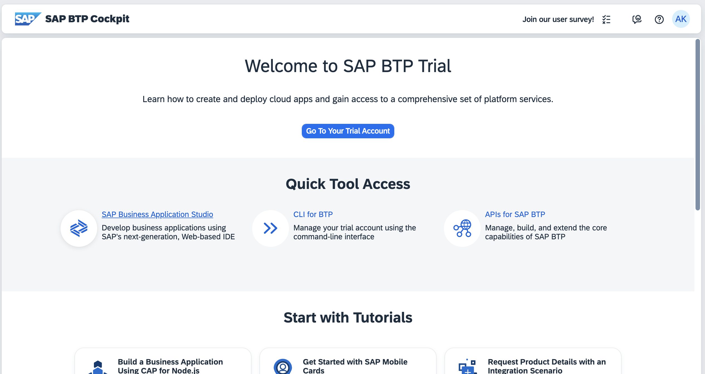
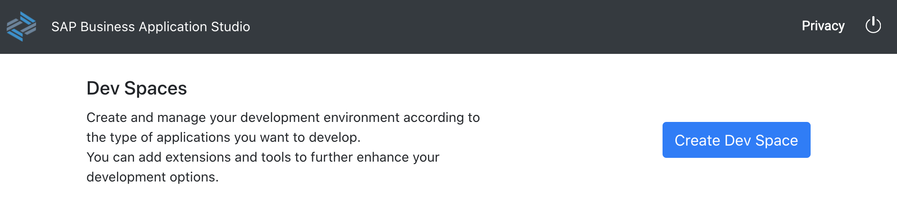
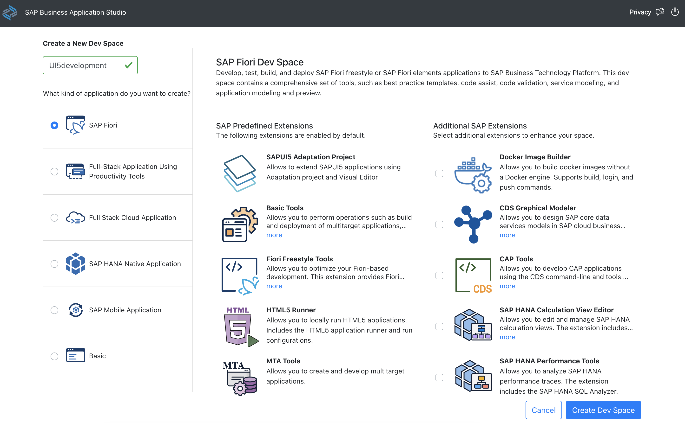
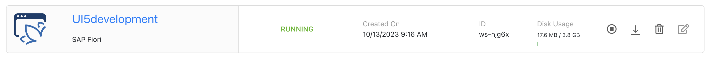
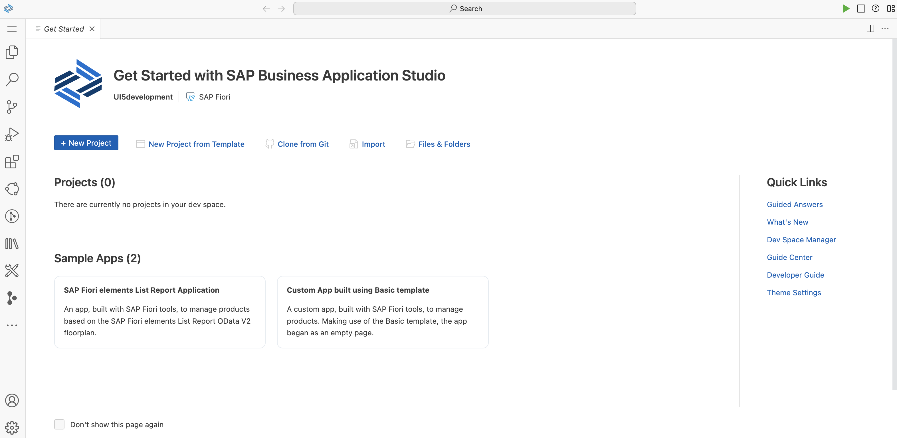

# Exercise 0 - Getting Started

In this exercise, you will be guided on how to access your SAP Business Application Studio account, set up a development space, and gain a quick introduction to its functionalities.

## Accessing SAP Business Application Studio Using Your Trial Account

By the end of these steps, you will know how to navigate to the SAP Business Application Studio and set it up for your development needs.

1. Open [your trial account entry page](https://cockpit.hanatrial.ondemand.com/trial/#/home/trial) using a web browser of your preference (Google Chrome, Microsoft Edge, Apple Safari, etc.) and log in using your credentials. If you encounter any issues logging in, ensure you meet the [requirements](../../../../README.md#requirements), specifically having [created a trial account](https://developers.sap.com/tutorials/hcp-create-trial-account.html).

2. Click on the SAP Business Application Studio link on the left side of the page.

3. It's time to create your development space! Click on *Create Dev Space*.

4. Assign a name to your new development space, for instance, *UI5development*. Choose *SAP Fiori* as the application type and click on *Create Dev Space*. 

>#### 🧑‍🎓 Explanation
> The options on the left are presets of extensions that come preinstalled in your development space. Choose the preset that best aligns with your needs. 
>
> The right section of the configuration displays the preselected extensions based on your chosen setting. It also allows you to enhance your settings with extra add-ons if you need a specific module, such as *CAP Tools*, for creating a full stack application.

5. Your development space is now being set up and launched. This process may take a few minutes. Please wait until the status indicates *RUNNING*.

6. Click on your development space name, for example, *UI5development*. This will lead you to your freshly created SAP Business Application Studio development space.

7. We recommend bookmarking this URL for easy access to the SAP Business Application Studio within your development space.

## Summary

Congratulations! You've successfully logged into your SAP Business Application Studio account, created your own dev space, and familiarized yourself with the basics of the platform. Keep up the momentum as you continue to [Exercise 1 - Project Setup Using SAP Business Application Studio](../ex1/README.md).
