

# Exercise 1 - Project Setup Using SAP Business Application Studio

In this exercise you'll create a new UI5 application based on a template provided by SAP Business Application Studio.

## Scenario

Your customer "Keep Cool, Inc." is an operator of several icehouses across the country. Recently, they have been upgraded with new sensors with Internet connection, so that their measuring values are available as a service. To make use of this data and improve their internal workflows, the company asked us to provide an application leveraging this sensor data, visualize it, and provide an overview of the current state of each sensor, so that they can react quickly on any issues.

## Exercise 1.1 - Create a New UI5 Application

After completing these steps you'll have created your first UI5 application.

1. Click on *New Project from Template* on the *Get Started* page.
    * [Optional] If you have closed the *Get Started* page accidentally, click on the top-most button (three horizontal lines, also known as the 'hamburger icon') in the left-hand navigation bar and then select *Help*, then select *Get Started* to re-open the page.</ul>

 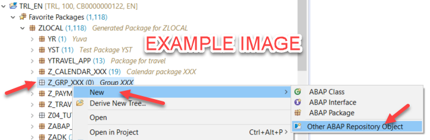  

2. Click on *SAP Fiori application* as template and click *Start*.

 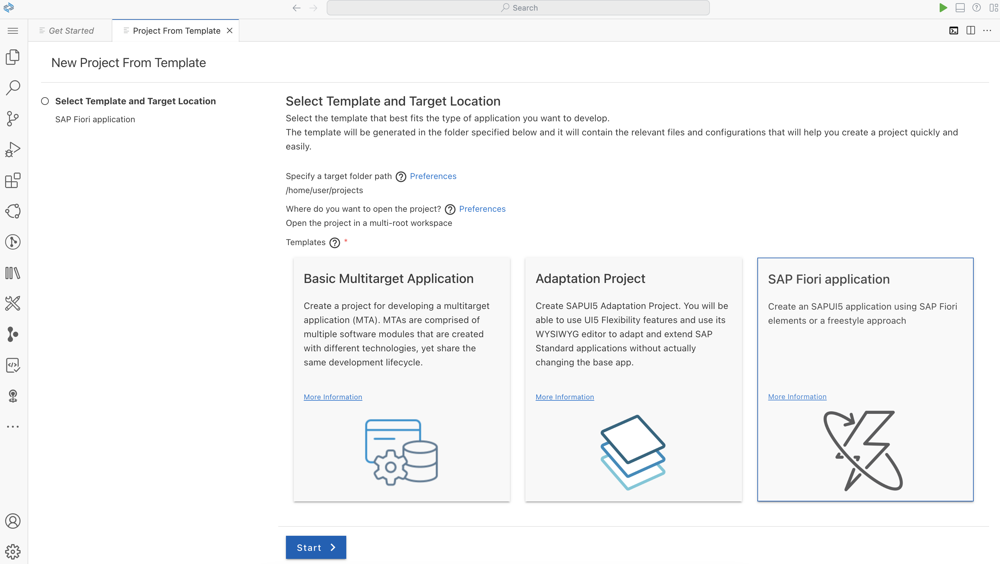  

3. In the *Template Selection* step, select *Basic* as application template and click *Next* (keep the "template Type" *SAP Fiori*).

 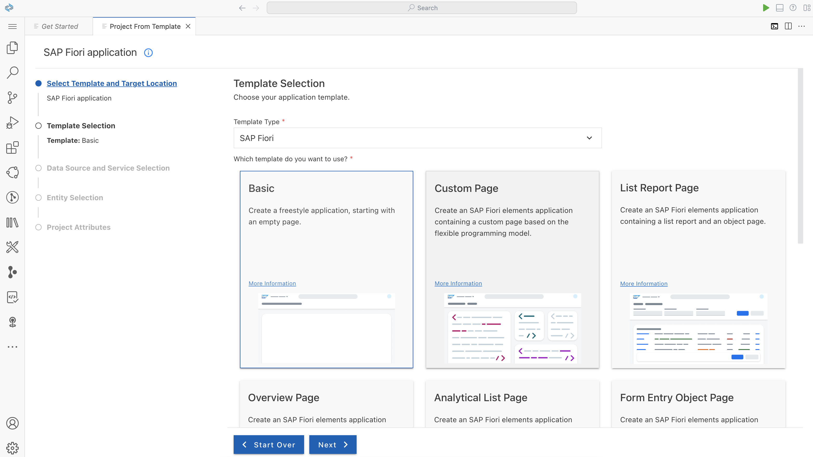  

4. Select *None* as Data Source, since you develop without an external data source. Click *Next*

 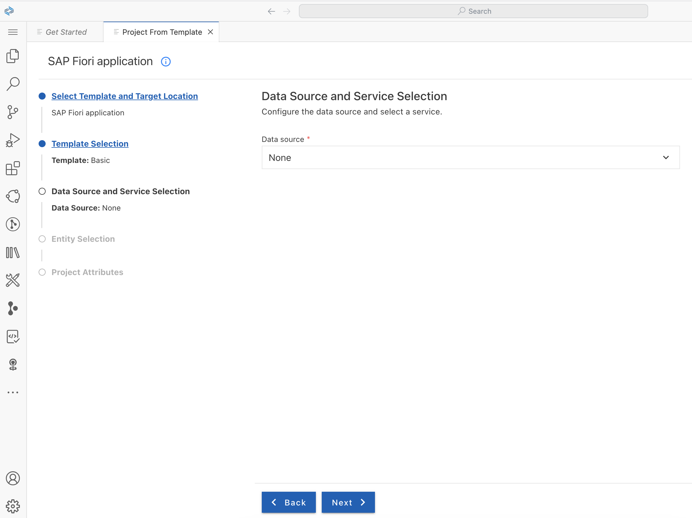  

5. Enter *Sensors* as view name in the next step. (even though this step is titled "Entity Selection", you don't select an entity set, since you start without a data service).

 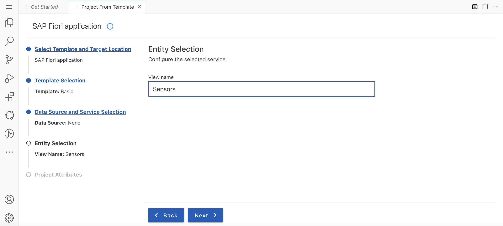  

6. Enter the following settings in the *Project Attributes* step:
    1. Enter *sensormanager* as *Module name*.
    2. Enter *Sensor Manager* as *Application title*.
    3. Enter *keepcool* as your namespace.
    4. You can keep the default description.
    5. Keep the Project folder path as */home/user/projects*
    6. Keep the latest available UI5 release selected.
    7. Set *Add deployment configuration* to *Yes*.
    8. Set *Configure advanced options* to *Yes*. New options appear below.
    9. At the very bottom, set *Enable TypeScript* to *Yes* to implement the application using TypeScript.
    10. Click *Next*.
 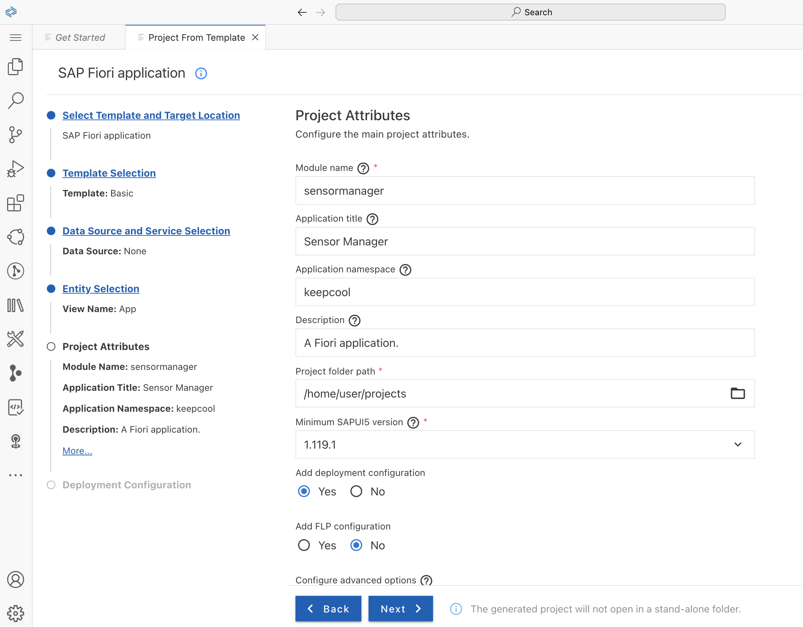  
 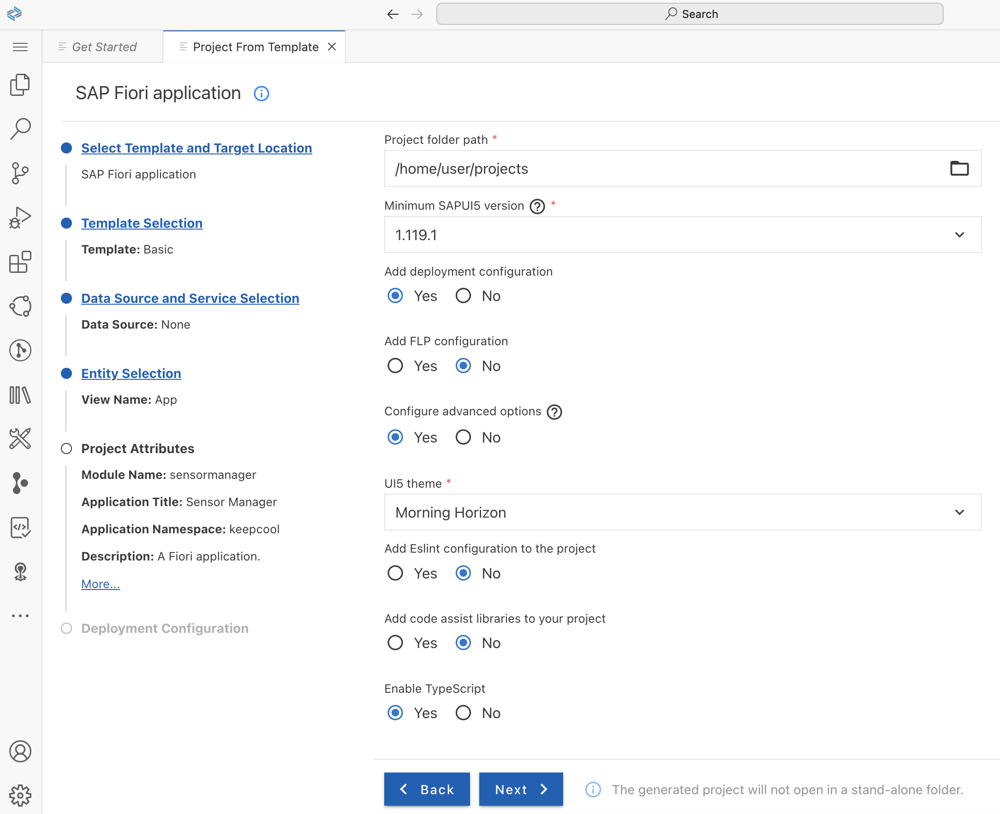  

7. In the next step, select *Cloud Foundry* as target, leave the Destination name to "None" and make sure that the *Yes* is checked for adding the application to the application router and click *Finish*.  </ul>

  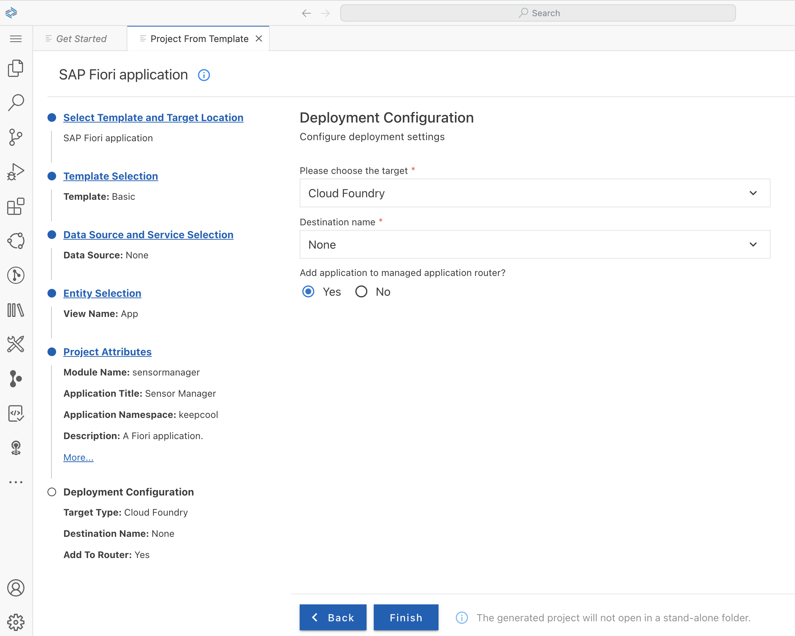  

8. The project is now being generated, and a notification window will appear in the lower right corner once the process has completed. Wait for the message that the project has been generated!

9. A warning popup may tell you that the project "is not in current workspace"; in this case, select the left button "Add project to workspace".

  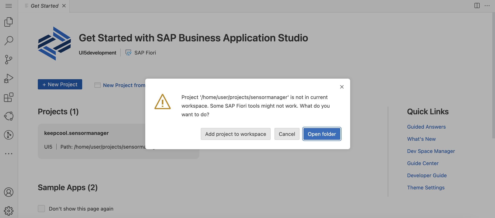  

10. Once the process has completed, the *Storyboard* opens, which will get useful for larger projects with external data sources. We don't make use of it in this tutorial. Instead, you can open the *Application Info* page to get an overview of the project and the list of things you can do with the project. To do so, open the Command Palette using the command `CTRL + Shift + P` (`Cmd + Shift + P` on Mac), then filter for "*Fiori: Open Application Info*" and select it.

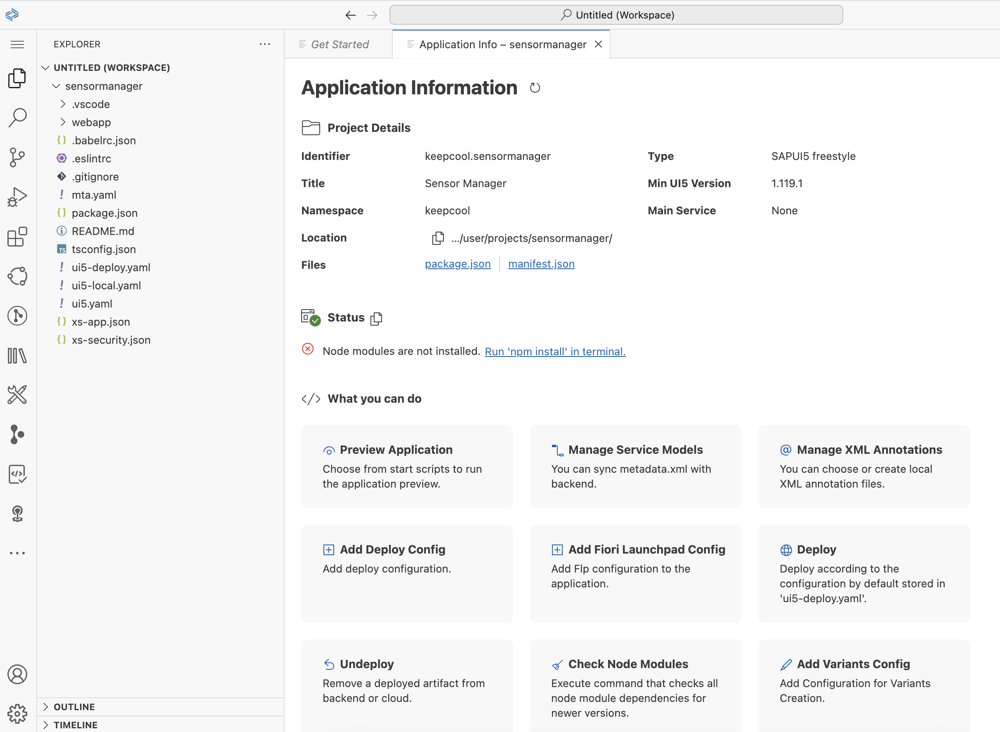

## Exercise 1.2 - Try out the generated Application

It's time for a first preview of your newly created application!

1. To start the application, press the green *play* icon ("Run and Debug") on the right side of the header bar.

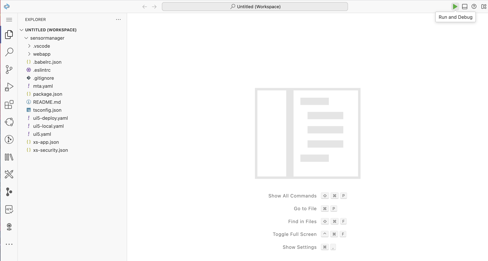

2. In the dropdown that opens in the header, select the first entry "Start sensormanager" (*without* "Local"). (For subsequent starts this selection will be remembered.)

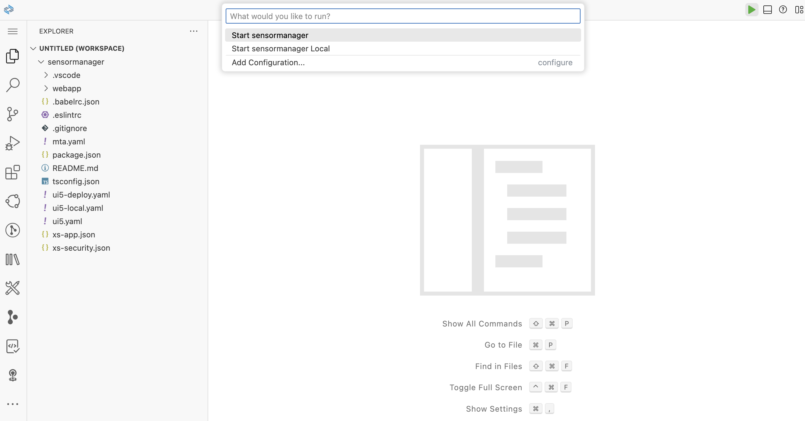

3. After a few moments, the application should start up:

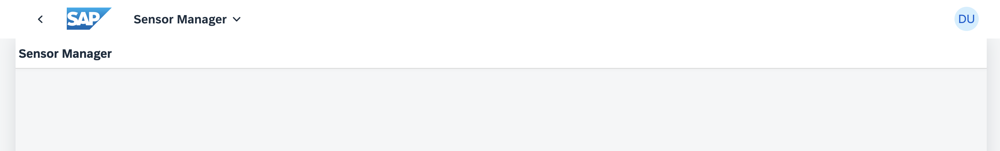

## Summary
Well done! You have successfully created and previewed a new UI5 application using SAP Business Application Studio.

You're now ready to leverage sensor data for "Keep Cool, Inc.". This foundational step puts you on track to improve their workflow and react quickly to any sensor issues. Keep up the good work as you proceed to [Exercise 2 - Add First Content](../ex2/README.md).
