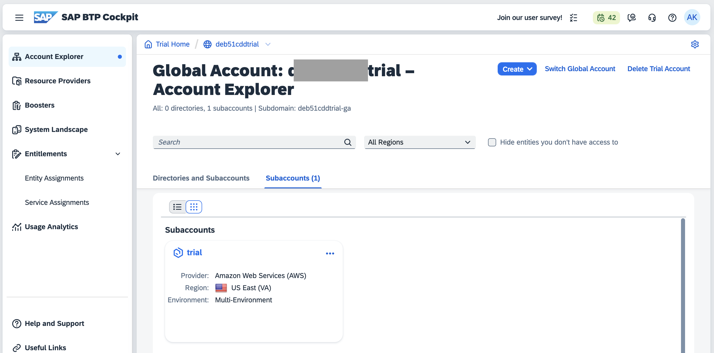

# Exercise 10 - Deploy Your App to SAP BTP, Cloud Foundry runtime

In this exercise you'll learn how easy it is to deploy your application directly from SAP Business Application Studio to the SAP BTP, Cloud Foundry runtime.

## Exercise 10.1 - Create Space in Cloud Foundry

First of all, you need to create the space in your Cloud Foundry environment to host your newly created UI5 application.

1. Open the SAP BTP Trial by opening *https://cockpit.hanatrial.ondemand.com/cockpit/#/home/trial* in a new browser tab and click *Go To Your Trial Account*.

2. You're redirected to your personal SAP BTP Cockpit where your subaccounts are listed. Click on the *trial* subaccount.

3. Open *Spaces* below the menu item *Cloud Foundry* (expand *Cloud Foundry* if needed). Until now, no space was created by you within this tutorial (but a *dev* space might already exist). Click *Create Space*.

4. In the popup, enter the space name, e.g. *ui5-apps* and leave the role selection as-is. Click *Create*.

5. The newly created space is displayed.

6. Do NOT click on the space name (this would enter the space, which we do not need right now). If you did, click on the "trial" subaccount above the content area to navigate up again.

## Exercise 10.2 - Subscribe to the SAP Build Work Zone Service

To be able to display deployed UI5 applications we need the "SAP Build Work Zone, standard edition" service (formerly known as "Launchpad Service") in our trial account.

1. To subscribe to it, click on *Service Marketplace* at the left-hand side below *Services* and search the "SAP Build Work Zone, standard edition" service.

2. Click on the "SAP Build Work Zone, standard edition" service tile and then on *Create* on the right hand side.

3. In the empty dropdown list labelled "Plan", select "standard - Subscription" and click *Create*.

4. Close the "Creation in Progress" popup. If you now click on *Instance and Subscriptions* you'll see that you have subscribed to the Launchpad Service.

## Exercise 10.3 - Login to Cloud Foundry

Now you can login to your Cloud Foundry environment directly from SAP Business Application Studio.

1. Open SAP Business Application Studio. Click the top-most button in the left sidebar (three horizontal lines), then on *View*, then select *Command Palette...*. (Alternatively press `CTRL + Shift + P` on Windows/Linux, `Cmd + Shift + P` on Mac.) Then start typing *CF: Login to cloud foundry* until you can see and click the respective entry.
Now specify your user credentials and sign in.

## Exercise 10.4 - Set Organization and Space

After logging in you're asked to specify your desired Cloud Foundry organization and space. Select the *ui5-apps* space you created above and press "Apply":

## Exercise 10.5 - Build Your Application

Now it's time to build your application. Yeah!

1. Right-click the `mta.yaml` file in the root folder.

2. Select *Build MTA Project*. The build starts.

3. Once the build has finished the terminal will display messages that the MTA archive has been generated and temporary files are cleaned up:

## Exercise 10.6 - Deploy Your Application

The build step has created a file named `keepcool-sensormanager_0.0.1.mtar` located under `mta_archives`. This file contains your build.

1. Right-click `sensormanager/mta_archives/keepcool-sensormanager_0.0.1.mtar` and select *Deploy MTA Archive*. Deployment starts.

2. Deployment takes some time. Once it is complete, you'll be notified in the terminal.

## Exercise 10.7 - Run Your Application on SAP BTP

1. The deployed application can be started from the SAP BTP Cockpit. Go to your trial subaccount and click on the *HTML5 Applications* section at the left hand side. The application is listed there as 'keepcoolsensormanager'. Click on it to start it.

> NOTE: the application is NOT listed among *Applications* in the "ui5-apps" space, but among *HTML5 Applications* in the containing "trial" subaccount!

2. Congratulations! You've deployed your UI5 application to the SAP BTP, Cloud Foundry runtime.

## Summary
Great job! You've learned how to deploy your UI5 application from SAP Business Application Studio to the SAP BTP, Cloud Foundry runtime. From creating a space in Cloud Foundry, subscribing to the SAP Build Work Zone Service, logging into Cloud Foundry, setting up your organization and space, configuring your application, building and finally deploying your application - you've done it all!

Keep up the good work and stay curious about SAPUI5 as there is still a lot to learn! Find more information and tutorials about SAPUI5 and BTP below.

## Further Information

* UI5 Tutorials: https://sapui5.hana.ondemand.com/#/topic/8b49fc198bf04b2d9800fc37fecbb218
* SAP Tutorials: https://developers.sap.com/tutorial-navigator.html