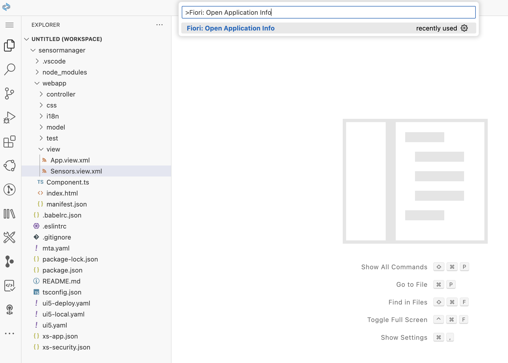

[](https://github.com/SAP-samples/teched2023-AD283v/tree/code/exercises/ex2)
[](https://pages.github.com/SAP-Samples/teched2023-AD283v/ex2/test/flpSandbox.html?sap-ui-xx-viewCache=false#keepcoolsensormanager-display)

# Exercise 2 - Add First Content

In this exercise you'll add some content to your application. A UI5 view showing multiple temperature sensors will be the first part of your app.

## Exercise 2.1 - Understand XML Views

After completing these steps you'll have written your first UI5 view. But before creating content, let's take a look at the pre-created views - first at the application's root view located under `sensormanager/webapp/view/App.view.xml`. It only contains a single `App` control, that's a special UI5 control, which can be used to display and navigate between different pages. We'll see how pages are added and how this navigating works, when we have a look at the *routing* later on.

```xml
<mvc:View controllerName="keepcool.sensormanager.controller.App"
    xmlns:html="http://www.w3.org/1999/xhtml"
    xmlns:mvc="sap.ui.core.mvc" displayBlock="true"
    xmlns="sap.m">
    <App id="app">
    </App>
</mvc:View>
```

The second view, `sensormanager/webapp/view/Sensors.view.xml`, contains a single `Page` control with empty `content`:

```xml
<mvc:View controllerName="keepcool.sensormanager.controller.Sensors"
    xmlns:mvc="sap.ui.core.mvc" displayBlock="true"
    xmlns="sap.m">
    <Page id="page" title="{i18n>title}">
        <content />
    </Page>
</mvc:View>

```

> #### 🧑‍🎓 Explanation
> XML views are the recommended (but not only) way in SAPUI5 to define the user interface structure. The tags with capital letters represent UI5 controls - user interface elements either provided as part of UI5 or created as custom controls in application code. UI5 comes with hundreds of such controls from simple buttons to complex animated layouts or things like tables and charts.
>
> Container controls like `App` and `Page` have the ability to embed nested child controls, which is nicely reflected in the XML structure. Sometimes these containers have different areas ("aggregations") for child controls. Those are represented as all-lowercase tags like `<content>` and define into which such area the contained child elements should go.
>
> The attributes of the XML tags like `id` and `title` are used to declaratively assign properties, event handlers etc.
>
> As UI5 controls are developed inside different "libraries", XML namespaces are used to properly indicate from which library (and sub-folder inside a library) each control should come. E.g. the default namespace in this XML view is "sap.m". This means all XML tags without namespace like `<Page>` represent controls from the `sap.m` library. The root tag `<mvc:View>`, on the other hand, is the `View` control inside the `mvc` folder in the `sap.ui.core` library.
>
> At runtime, UI5 instantiates the respective controls, assigns the properties, puts the controls together into a nested tree structure, and makes them create the actual HTML displayed by the browser.

## Exercise 2.2 - Add Content to Sensors.view.xml

Now let's finally add some content!

1. Add an empty `sap.m.IconTabBar` to `Sensors.view.xml` by replacing its content as follows:

###### sensormanager/webapp/view/Sensors.view.xml

```xml
<mvc:View controllerName="keepcool.sensormanager.controller.Sensors"
    xmlns:mvc="sap.ui.core.mvc" displayBlock="true"
    xmlns="sap.m">
    <Page id="page" title="{i18n>title}">
        <content>
            <IconTabBar id="iconTabBar" class="sapUiResponsiveContentPadding">
                <content>
                </content>
            </IconTabBar>
        </content>
    </Page>
</mvc:View>
```

> #### 🧑‍🎓 Explanation
> The `<content>` aggregation of the `<Page>` now contains an `<IconTabBar>` control. The attribute `class="sapUiResponsiveContentPadding"` means that the CSS class `sapUiResponsiveContentPadding` shall be written to the HTML. This is one of the predefined UI5 CSS classes and adds some padding around the content of the IconTabBar (we will add this content soon). This padding is *responsive*, which means it depends on the screen/window size and will be smaller when the available space is limited.


## Exercise 2.3 - Add Dependencies

In addition to the main UI5 library `sap.m`, you will use other control libraries like `sap.ui.layout` in your application. The central point for configuring your UI5 application is the `manifest.json` file, which is located at `sensormanager/webapp/manifest.json`.
 
1. You can either locate this file in the File Explorer on the left-hand side or directly access `manifest.json` using the link in the *Application Info* page. If you have closed the *Application Info* page again or not opened it in the previous exercise, you can open it by using the command `Fiori: Open Application Info` from command palette (`CTRL + Shift + P` on Windows/Linux, `Cmd + Shift + P` on Mac).




2. In `manifest.json`, go to the section `sap.ui5` (CAUTION: NOT the section `sap.ui`!).
3. Add two libraries in the `dependencies/libs` section. UI5 will take care of loading all the libraries listed here when your app is started.

###### sensormanager/webapp/manifest.json

```json
        "dependencies": {
	    ...
            "libs": {
                ... ,
                "sap.ui.layout": {},
                "sap.suite.ui.microchart": {}
            }
        },
```
>💡 Don't forget adding a comma after the previous entry when you add these two!


To see the result of what you did, open the browser tab with the application preview (or press the top-right green "play" arrow again in case you closed the tab). The application is automatically being updated whenever you do code changes. You cannot see the `sap.m.IconTabBar` very well yet, as it is still empty. But there is an additional line now and you will soon see much more!


## Summary

Great job! You've successfully added content to your application and added further libraries to your application's `manifest.json` file for future use. Keep up the good work as you continue to [Exercise 3 - Show Sensor Content](../ex3/README.md).


## Further Information

* UI5 SDK (all the documentation): https://ui5.sap.com/
* Views in UI5: https://ui5.sap.com/#/topic/91f27e3e6f4d1014b6dd926db0e91070
* Using Container Content Padding CSS Classes: https://ui5.sap.com/#/topic/c71f6df62dae47ca8284310a6f5fc80a
* Theming: https://experience.sap.com/internal/fiori-design-web/theming/
