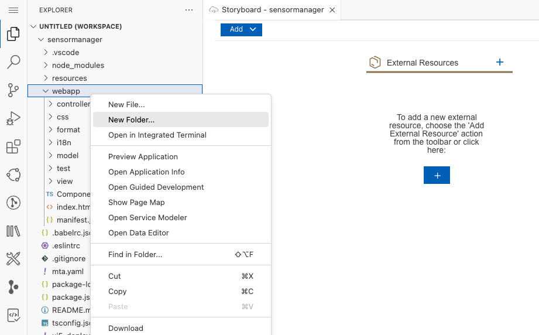
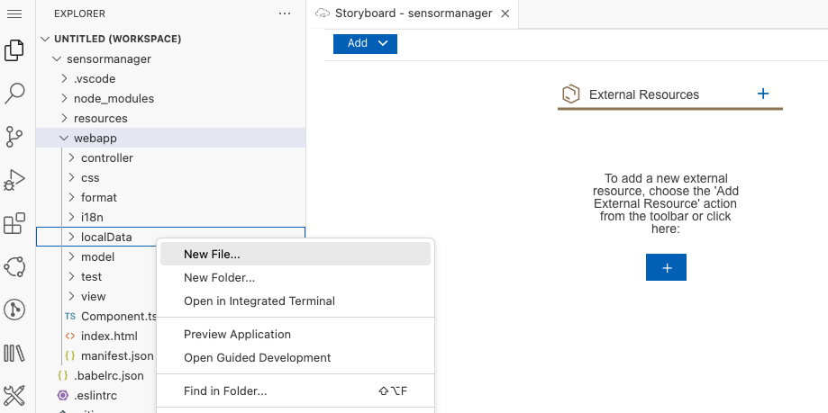
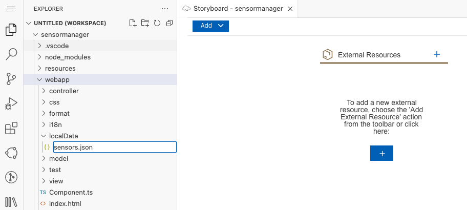
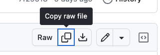
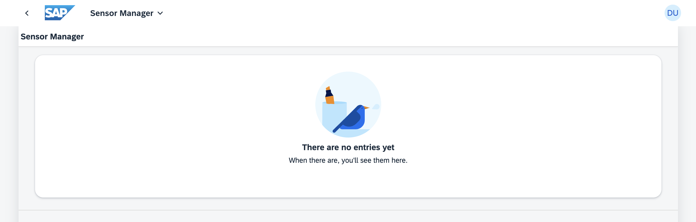
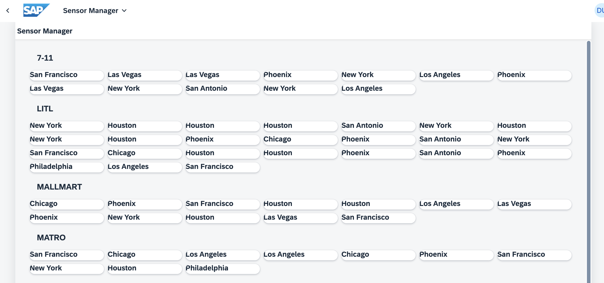

[](https://github.com/SAP-samples/teched2023-AD283v/tree/code/exercises/ex3)
[](https://pages.github.com/SAP-Samples/teched2023-AD283v/ex3/test/flpSandbox.html?sap-ui-xx-viewCache=false#keepcoolsensormanager-display)
# Exercise 3 - Show Sensor Content

In this exercise you'll add a local data source to the application and display the data on the further enhanced UI5 view.

## Exercise 3.1 - Import Sensor Data

To simulate a server providing sensor data, you'll now add some local sensor data to your application.

1. Right-click on the `sensormanager/webapp/` folder and select *New Folder*.



2. Enter *localData* as the folder name and confirm by pressing *Enter*.

3. Right-click on the `localData` folder and select `New File`.



4. Enter `sensors.json` as file name and confirm by pressing *Enter*.



5. Copy and paste the content of [sensors.json](data/sensors.json) into the newly created file. Hint: when you follow the link, there is a "Copy raw file" button (looks like overlapping squares) in the header right above the file content.



## Exercise 3.2 - Configure a Data Source

After adding the sensor data to your application, you'll need to configure the data source which provides the sensor data.

1. Click on `manifest.json` link in the *Application Info* page. If you had closed the *Application Info* page, you can reopen it by using command `Fiori: Open Application Info` from the command palette. You can also find the `manifest.json` file located under `sensormanager/webapp`.

2. Go to the section `sap.app`. Here, at the end of the list, after "sourceTemplate", add the `dataSources` section as follows:

###### sensormanager/webapp/manifest.json

```js
    "sap.app": {
        ... ,
        "dataSources": {
            "sensorSource": {
                "type": "JSON",
                "uri": "./localData/sensors.json"
            }
        }
    }
```

>💡 Again, do not forget adding the comma after the previous block "sourceTemplate".

> 🧑‍🎓 The `sensorSource`, points to the sensor data file which you have just added to the `localData` folder. In real-life applications, you often configure a URI of an actual service here and its type ("OData") and protocol version.

3. Go to the section `sap.ui5`. (Not `sap.ui`!) Here, add a "sensorModel" section as follows:

###### sensormanager/webapp/manifest.json

```js
"sap.ui5": {
  ...
  "models": {
      "i18n": {
          "type": "sap.ui.model.resource.ResourceModel",
          "settings": {
              "bundleName": "keepcool.sensormanager.i18n.i18n"
          }
      },
      "sensorModel": {
          "type": "sap.ui.model.json.JSONModel",
          "dataSource": "sensorSource"
      }
  },
```

> 🧑‍🎓 This adds the `JSONModel` with name `sensorModel`, which will provide data access in the application and refers to the data source that has been created above.

4. Since this workshop does not use flexibility services, disable them by changing the first entry in the `sap.ui5` section as follows:

```js
    "sap.ui5": {
      "flexEnabled": false,
    ...
```

## Exercise 3.3 - Add a GridList

After configuring the data service, it's now time to enrich your `Sensors.view.xml` with some fancy UI5 controls!

1. Open the `Sensors.view.xml` located under `sensormanager/webapp/view`.

2. Add `sap.f` and `sap.ui.layout.cssgrid` to the xml namespace declarations to make sure that the required resources are available in your view. Re-arrange the content a bit for a better overview, so it will look like this:

###### sensormanager/webapp/view/Sensors.view.xml

```xml
<mvc:View
    controllerName="keepcool.sensormanager.controller.Sensors"
    xmlns:mvc="sap.ui.core.mvc"
    xmlns="sap.m"
    xmlns:f="sap.f"
    xmlns:grid="sap.ui.layout.cssgrid"
    displayBlock="true">
```

3. Add `sap.f.GridList` to the `content` aggregation of the IconTabBar (between `<content>` and `</content>`).

###### sensormanager/webapp/view/Sensors.view.xml

```xml
                    <f:GridList id="sensorsList">
                        <f:items>
                            <!-- item template will be added here! -->
                        </f:items>
                        <f:noData>
                            <IllustratedMessage enableVerticalResponsiveness="true" illustrationType="sapIllus-EmptyList"/>
                        </f:noData>
                    </f:GridList>
```

> 🧑‍🎓 As seen before, an *aggregation* is the parent-child relationship within the tree structure of UI elements. The child end of the relation may have cardinality 0..1 or 0..*. The elements' API offers convenient and consistent methods to deal with aggregations (e.g. to get, set, or remove child elements). Examples are table rows and cells, or the content of a table cell.
> The `noData` aggregation content - an illustrated message - is displayed when no data is available to be displayed in items.

4. Switch to the browser tab with the preview and see the updated UI5 application (refresh/restart if needed).



## Exercise 3.4 - Add Data Binding

After adding the `sap.f.GridList` control, you'll need to connect the control to the sensor data. For this, UI5 provides a mechanism called *Data Binding*.

1. In case you closed it, open the `Sensors.view.xml` located under `sensormanager/webapp/view`.

2. Bind the `items` aggregation of the `sap.f.GridList` to the path `sensorModel>/sensors`. Here, `sensorModel` is  the name of your recently defined data model, and `/sensors` points to a property inside it. As this property holds an array with several entries, you'd probably like to define sorting and grouping as well. In the `sorter` you can configure this by using the properties available. To do all of this, change the `<f:GridList ...>` opening tag as follows:

###### sensormanager/webapp/view/Sensors.view.xml

```xml
                    <f:GridList
                        id="sensorsList"
                        items="{path: 'sensorModel>/sensors', sorter: {path:'customer', group:true, descending: false}}"
                        noDataText="No sensors">
```

3. The list items are defined *once* as a template, which is then automatically repeated multiple times by the UI5 data binding to represent each entry of the sensors array. Each list item will automatically receive the data of one array entry from the json file. We also add some location details to our `sap.f.GridListItem`. Here, `location` references the location property of each of the displayed sensor items. Replace the comment `<!-- item template will be added here!>` with the following item template:

###### sensormanager/webapp/view/Sensors.view.xml

```xml
                            <f:GridListItem>
                                <Title text="{sensorModel>location}"/>
                            </f:GridListItem>
```

4. Let's see if our UI5 application displays the correct sensor data. Switch to the browser tab with the opened application preview (reload the page or re-launch the application if needed).



## Summary
Great job! You've successfully added local data to your application, imported the sensor data, configured a data source, and displayed the data using UI5 controls. This showed you how UI5's data binding can be used to populate the user interface. Your application now has a richer interface and is ready to show sensor data. Keep up the great work as you move on to [Exercise 4 - Introduce Localization](../ex4/README.md).

## Further Information

* Data Binding: https://ui5.sap.com/#/topic/68b9644a253741e8a4b9e4279a35c247
