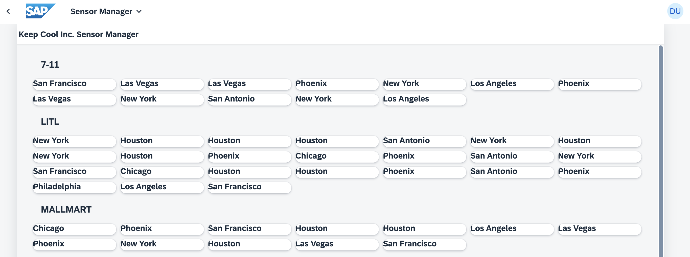
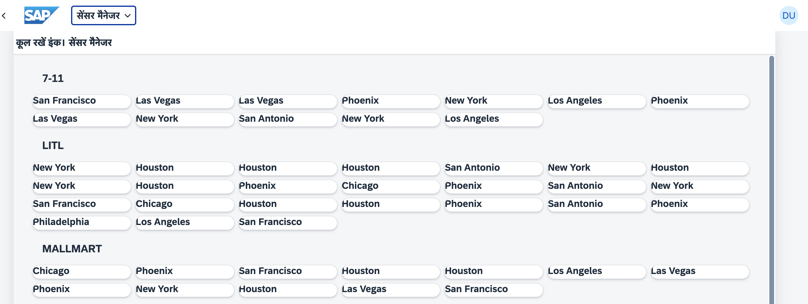

[](https://github.com/SAP-samples/teched2023-AD283v/tree/code/exercises/ex4)
[](https://pages.github.com/SAP-Samples/teched2023-AD283v/ex4/test/flpSandbox.html?sap-ui-xx-viewCache=false#keepcoolsensormanager-display)

# Exercise 4 - Introduce Localization (i18n)

In this exercise you'll learn how easy it is to enable localization for your UI5 application.

## Exercise 4.1 - Using i18n Variables

SAPUI5 has the option to support different languages, configurable based on the user's preferences. Its enterprise-ready capabilities include comprehensive localization features like number and date formatting, support for right-to-left languages and more, enabling developers to effortlessly tailor their applications to various languages and regions, thus ensuring global accessibility and user-friendliness. In this exercise we'll focus on translation.

Find the `i18n.properties` file, which is located under `sensormanager/webapp/i18n/` and contains translatable texts. Replace the content with the following set of variables:

###### sensormanager/webapp/i18n/i18n.properties

```ini
title=Keep Cool Inc. Sensor Manager
appTitle=Sensor Manager
appDescription=The sensor manager
noSensorDataText=No Sensor Data
msgSensorDataLoaded=All sensors online!
msgFilterAll=All
msgFilterCold=Cold
msgFilterWarm=Warm
msgFilterHot=Too Hot
toolTipShowCustomers=Show Customers
titleCustomerDialog=Customers
titleSensorStatus=Sensor Status
cardTitle=Customer
temperatureUnit=°C
```

>💡 Some of the texts will only be used in upcoming exercises.

1. Switch browser tabs (refresh if needed) to see how the title of your UI5 application changed.



## Exercise 4.2 - Add Additional Languages

Your UI5 application is prepared for localization. But right now no matter which browser language is configured, your UI5 application currently displays the texts of the `i18n.properties` file.
Let's provide new language files for English and Hindi.

1. Go to folder `sensormanager/webapp/i18n/` and right-click it.

2. In the popup, click `New File`.

3. Enter `i18n_en.properties` as file name.

4. Repeat Steps 1 and 2.

5. Enter `i18n_hi.properties` as file name.

6. Open `i18n_en.properties` and paste the following content:

###### sensormanager/webapp/i18n/i18n_en.properties

```ini
title=Keep Cool Inc. Sensor Manager
appTitle=Sensor Manager
appDescription=The sensor
noSensorDataText=No Sensor Data
msgSensorDataLoaded=All sensors online!
msgFilterAll=All
msgFilterCold=Cold
msgFilterWarm=Warm
msgFilterHot=Too Hot
toolTipShowCustomers=Show Customers
titleCustomerDialog=Customers
titleSensorStatus=Sensor Status
cardTitle=Customer
temperatureUnit=°F
```

> Why English again? The original `i18n.properties` file already was English! Commonly the original language is "developer English", serving as input for translations, including review by a translation expert for English to ensure good language. In some cases, the original language may not even be English. Note, that we change the temperature here to reflect Fahrenheit as commonly used measurement for temperatures in some English speaking countries. You can choose whichever suits best.

7. Open `i18n_hi.properties` and paste the following content:

###### sensormanager/webapp/i18n/i18n_hi.properties

```ini
title=कूल रखें इंक। सेंसर मैनेजर
appTitle=सेंसर मैनेजर
appDescription=सेंसर मैनेजर
noSensorDataText=कोई सेंसर डेटा नहीं
msgSensorDataLoaded=सभी सेंसर ऑनलाइन हैं!
msgFilterAll=सभी
msgFilterCold=ठंडा
msgFilterWarm=गर्म
msgFilterHot=बहुत गर्म
toolTipShowCustomers=ग्राहक दिखाएं
titleCustomerDialog=ग्राहक
titleSensorStatus=सेंसर स्थिति
cardTitle=ग्राहक
temperatureUnit=°C
```

8. Depending on the browser language you've configured, you should now be able to see different text on your user interface.
    * If your browser language is English, the content of `i18n_en.properties` is used.
    * If your browser language is Hindi, the content of `i18n_hi.properties` is used.
    * For any other language, the content of `i18n.properties` is used.

## Exercise 4.3 - Configure Supported Languages

Usually, only the `i18n.properties` file is maintained by developers. The language-dependent files will be filled by native speakers or translators. As an application developer, you can configure which languages are supported by your application, and which language is your default (aka fallback) language. In this session English will be the default language, and additionally Hindi should be supported.

1. Click on `manifest.json` link in the *Application Info* page. If you had closed the *Application Info* page, you can reopen it by using command `Fiori: Open Application Info` from command palette. You can also find the `manifest.json` file located under `sensormanager/webapp`.

2. Go to section `sap.ui5` / `models` / `i18n`. Here, add two new configurations inside your settings object.
      1. Add the property `supportedLocales` and assign the locales for Hindi and English `["hi", "en"]`
      2. Add the property `fallbackLocale` and assign the English locale `"en"`

###### sensormanager/webapp/manifest.json

```json
            "i18n": {
                "type": "sap.ui.model.resource.ResourceModel",
                "settings": {
                    "bundleName": "keepcool.sensormanager.i18n.i18n",
                    "supportedLocales": ["hi", "en"],
                    "fallbackLocale": "en"
                }
            },
```

>🧑‍🎓 This ResourceModel was provided as part of the application template and is a UI5 feature which provides UI texts automatically in the current language of the user. The data source for the model are the `i18n...` files we just created, linked to the model by the `bundleName`. In the XML view, the texts can be used like any other data from a model, using data binding.

3. Let's see if your UI5 application is able to start in English and Hindi! Switch to the browser tab with an opened application preview (reload the page if needed). The UI5 application should start in English or in Hindi, depending on your browser language.


4. UI5 supports the `sap-ui-language=...` URL parameter to simulate another browser language. The preview URL may already have other URL parameters plus a URL hash and look like this:
`...cloud.sap/test/flpSandbox.html?sap-ui-xx-viewCache=false#keepcoolsensormanager-display`. It is important to insert the new URL parameter for the language at the correct position and separate it from other URL parameters with an ampersand character (`&`). The easiest way may be to add it right behind the question mark, which separates the address from the parameters:
`...cloud.sap/test/flpSandbox.html?sap-ui-language=hi&sap-ui-xx-viewCache=false#keepcoolsensormanager-display`. Then Press `Enter`. UI5 should now start in Hindi regardless of the language you have configured as your browser language.

> If the URL just ends with `....cloud.sap/index.html`, without URL parameters, then you can simply append `?sap-ui-language=hi` to switch to Hindi.



5. Let's try to start the application in another language, e.g German. Change the above URL parameter to `sap-ui-language=de`. UI5 should now start in English, because German is not supported and you have configured English as your fallback locale.


If you'd like to support German, or any other language of your choice, feel free to repeat the steps described in [Exercise 4.2 Add New Languages](#exercise-42---add-additional-languages) with your desired language.

## Summary
Great job! You have successfully implemented translation in your UI5 application, allowing your app to support multiple languages based on user preferences. Along the way, you have learned how the resource model works and the application can be switched to different languages. This is a major step in making your application globally accessible and user-friendly. Keep up the good work and continue to [Exercise 5 - Improve Visualization](../ex5/README.md)!

## Further Information

* Localization: https://ui5.sap.com/#/topic/91f217c46f4d1014b6dd926db0e91070
* Supported Locales and Fallback: https://ui5.sap.com/#/topic/ec753bc539d748f689e3ac814e129563
