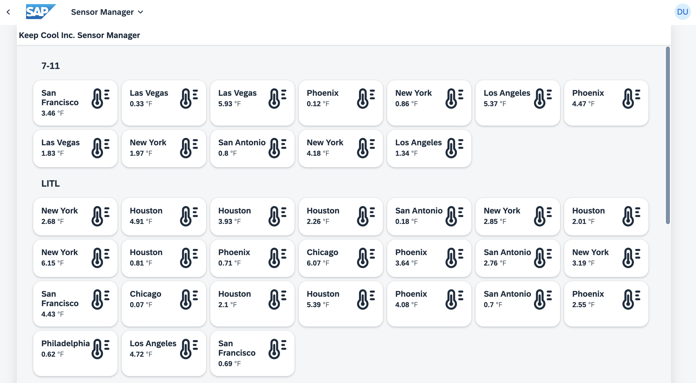
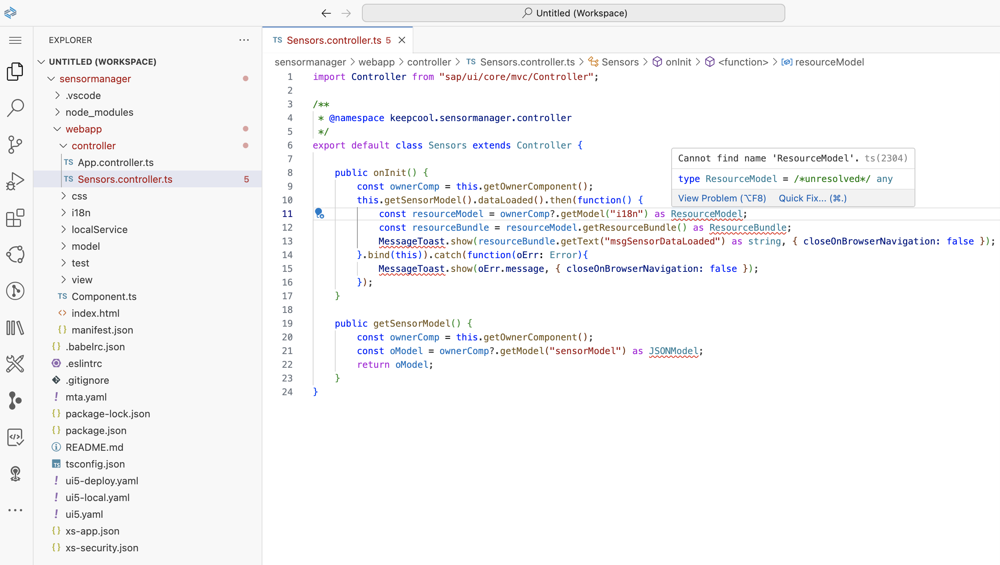
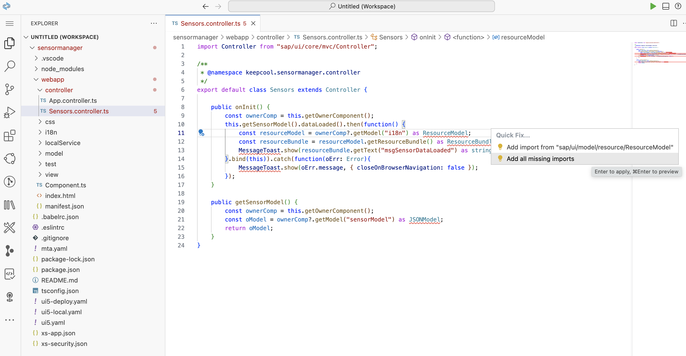
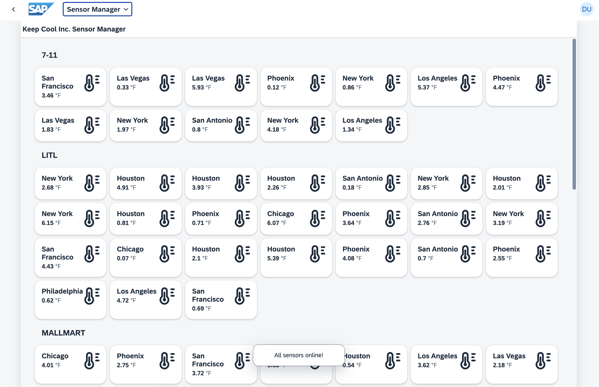
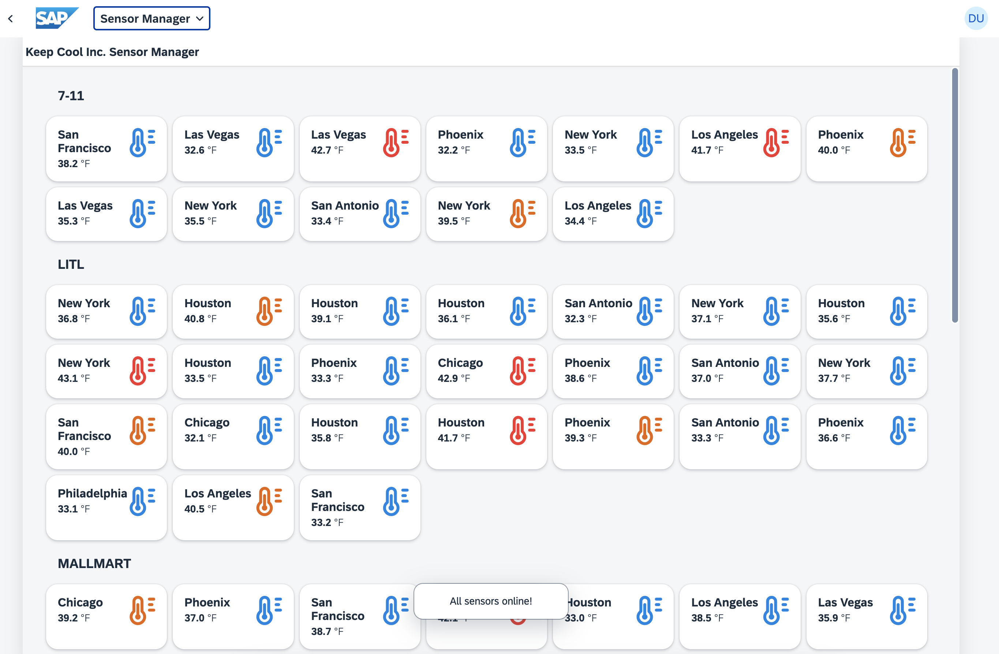

[](https://github.com/SAP-samples/teched2023-AD283v/tree/code/exercises/ex5)
[](https://pages.github.com/SAP-Samples/teched2023-AD283v/ex5/test/flpSandbox.html?sap-ui-xx-viewCache=false#keepcoolsensormanager-display)

# Exercise 5 - Improve Visualization

You achieved a lot in the previous exercises. Now it's time to dress up your UI5 application with better visuals!

## Exercise 5.1 - Enhance Sensors.view.xml

To give the customer the best possible overview, add some color to your application. Introduce a new layout and structure for the items, and also show an `sap.ui.core.Icon` there.

1. Open `Sensors.view.xml` and add the xml namespace `xmlns:core="sap.ui.core"` to the view to have the `sap.ui.core.Icon` available.

###### sensormanager/webapp/view/Sensors.view.xml

```xml
<mvc:View
    controllerName="keepcool.sensormanager.controller.Sensors"
    xmlns:core="sap.ui.core"
    xmlns:mvc="sap.ui.core.mvc"
    xmlns="sap.m"
    xmlns:f="sap.f"
    xmlns:grid="sap.ui.layout.cssgrid"
    displayBlock="true">
```

2. Add a temperature icon as well as a title, a number and some layouting to the `sap.f.GridListItem` (not "GridList"!) control.

###### sensormanager/webapp/view/Sensors.view.xml

```xml
                            <f:GridListItem type="Active">
                                <HBox justifyContent="SpaceBetween"
                                    class="sapUiSmallMargin">
                                    <VBox>
                                        <Title
                                            text="{sensorModel>location}"
                                            wrapping="true"/>
                                        <ObjectNumber
                                            number="{sensorModel>temperature}"
                                            unit="{i18n>temperatureUnit}"/>
                                    </VBox>
                                    <core:Icon
                                        src="sap-icon://temperature"
                                        size="2.5rem"/>
                                </HBox>
                            </f:GridListItem>
```
> 🧑‍🎓 `sapUiSmallMargin` is again a predefined CSS class, this time adding spacing *around* controls. `sap.m.HBox`and `sap.m.VBox` are helper controls for layouting your application by arranging content horizontally and vertically.

Let's take a look at the application and the changes in the item layout of the `GridList` control:



> 💡 Note that the temperature is not displayed correctly yet, as the formatter doing the Celsius-to-Fahrenheit conversion will only be added later in this exercise.

## Exercise 5.2 - Add Content to Sensors.controller.ts

In this exercise you'll enhance your application with some additional controller coding.

> #### 🧑‍🎓 Explanation
> This tutorial uses **TypeScript** instead of JavaScript and this exercise is the first one where you actually write such code, hence a brief introduction:
>
> TypeScript is not much different from JavaScript. In fact it is a super-set of JavaScript that just adds some language features *on top* which are used to specify the types of variables, function parameters etc. and define new types like complex structures. As a simple example, a variable can be specified to have type "string", then never a number can be assigned (which would be possible in JavaScript). The same is possible for more complex structures and classes. This type information is used by the code editor to massively help you writing code: code completion, inline documentation, prevention and early detection of errors, better refactoring, easier maintenance and much more. UI5 users who switched to TypeScript commonly confirm that it drastically increases development efficiency.
>
> Browsers cannot execute TypeScript, hence a transpilation step is needed, which converts the code to JavaScript - basically by stripping away all the type information. This also means the type safety and everything that TypeScript provides is purely focused on development time, not runtime of the code. Nevertheless the original sourcecode can be made available to browsers using "source maps", so when debugging you can see the original TypeScript code you wrote.
>
> Even the transpiled JavaScript code would look familar, though. As you see when looking at the TypeScript source files in the application, most of the code is plain JavaScript syntax! Most of the time, TypeScript-specific additions with type information are only in very few places.
>
> UI5 itself is written in JavaScript without any type information. But all the types of the UI5 APIs are declared in separate type definition files which are released by the UI5 development team. These make the editor and transpiler aware of what types parameters passed to UI5 must have and what types the returned values have. These type definitions are already added as dependencies in this template (the `@sapui5/types` dev dependency in the `package.json` file) and the transpilation step is also already set up and mostly transparent for you as developer (handled by the `ui5-tooling-transpile` build task and middleware for the UI5 tooling).
>
> With this knowledge you are now ready to create your first TypeScript file!


1. Have a look at `sensormanager/webapp/controller/Sensors.controller.ts`

###### sensormanager/webapp/controller/Sensors.controller.ts

```js
import Controller from "sap/ui/core/mvc/Controller";

/**
 * @namespace keepcool.sensormanager.controller
 */
export default class Sensors extends Controller {

    /*eslint-disable @typescript-eslint/no-empty-function*/
    public onInit(): void {

    }
}
```
> #### 🧑‍🎓 Explanation
> A controller is the place where you can add methods that implement functionality needed in the respective view. There is no such content yet, only `onInit`, which is one of the lifecycle methods called by the UI5 framework - this one is called when the controller is first initialized. Even this method is empty, hence the comment in the line above has been added in the template to avoid linting (code-checking) error messages. This comment can be deleted after adding method content.
>
> In case you have seen traditional UI5 application code before or haven't stayed in touch with the JavaScript language evolution over the last years, the syntax might look unfamiliar: it is an EcmaScript 6 module, the `import` statement at the top is loading a UI5 class as dependency. The lower half is the definition of an ES6 class - yes, there are classes in JavaScript now.
>
> This code is almost 100% pure JavaScript without TypeScript syntax (only the `: void` return type is TypeScript and even this part is not really needed, as the TypeScript compiler can infer the return type). As mentioned above, most of the code will still be valid JavaScript. TypeScript-specific additions are only needed where the TypeScript compiler cannot automatically infer the type of something. But here the type of the imported UI5 `Controller` class is known, thanks to the type definitions provided by UI5, and the type of the newly defined class is automatically understood by the TypeScript compiler. Hence there is no need to add any written type information for those.
>
> While we encourage the use of such modern JavaScript syntax when writing TypeScript, at runtime UI5 still requires the usage of UI5-specific APIs for module loading (`sap.ui.require(...)`/`sap.ui.define(...)`) and class definition (`SomeClass.extend("NewClassName", ...)`), hence in addition to the TypeScript transpilation also the ES6 module imports and classes are transformed to these UI5 APIs. The `@namespace` comment above the class is needed for this to create the class' full package name.

2. Try hovering the mouse above `Controller` and you will see some of the UI5 documentation for it. Thanks to TypeScript you can even navigate to the definition of the respective UI5 API. E.g. in SAP Business Application Studio and in Microsoft Visual Studio Code by holding the `Ctrl`/`Cmd` key while clicking the name. This does not lead to the original source code of UI5, which is written in JavaScript, but to the TypeScript type definition files of UI5, which include all documentation. It can be very helpful to browse through the methods offered by a class or to navigate further up the inheritance chain.

3. Your next goal is to show an `sap.m.MessageToast` when your sensor data is loaded. Replace the `onInit` function of `Sensors.controller.ts` and add a function `getSensorModel` to retrieve the sensor model (also remove the `eslint-disable` comment above `onInit`):


###### sensormanager/webapp/controller/Sensors.controller.ts

```typescript
    public onInit() {
        const ownerComp = this.getOwnerComponent();
        this.getSensorModel().dataLoaded().then(function() {
            const resourceModel = ownerComp?.getModel("i18n") as ResourceModel;
            const resourceBundle = resourceModel.getResourceBundle() as ResourceBundle;
            MessageToast.show(resourceBundle.getText("msgSensorDataLoaded") as string, { closeOnBrowserNavigation: false });
        }.bind(this)).catch(function(oErr: Error){
            MessageToast.show(oErr.message, { closeOnBrowserNavigation: false });
        });
    }

    public getSensorModel() {
        const ownerComp = this.getOwnerComponent();
        const oModel = ownerComp?.getModel("sensorModel") as JSONModel;
        return oModel;
    }

```

> 🧑‍🎓 This code *does* contain some additional TypeScript-specific syntax: statements like `...  as ResourceModel` and `... as string` are type casts which assert that the respective value is not just *some kind of model*, but a `ResourceModel` and not a *string or undefined*, but it is indeed a `string`. Also, `function(oErr: Error)` declares that the method parameter `oErr` is of type `Error` (one of the types built in to the language).

4. Note that some of the UI5 class names (ResourceModel, ResourceBundle, MessageToast and JSONModel) are underlined in red because they have not been imported yet. If you hover over them, you are offered a "Quick Fix" which adds the imports automatically:


Just click on *Quick Fix* and then select *Add all missing imports*. This adds all required dependencies as imports to the top of the controller file, without any typing.



5. Let's see if your UI5 application is able to show the `sap.m.MessageToast`! Switch to the browser tab with the opened application preview and reload the page. Pay attention to the bottom area: the `sap.m.MessageToast` should be displayed initially for a few seconds to confirm that your sensor data has been loaded successfully.



## Exercise 5.3 - Create your First Formatter

Your next goal is to bring some color to the user interface. You'd like to display the icon in a suitable color which is based on the actual temperature of the sensor. To do this, you can use the formatter concept of UI5.

>🧑‍🎓 Formatters are simple functions which can be used for transforming values when binding data to a view. E.g. the underlying value is a number (the temperature), but in the view it should be visualized as color. Then the formatter has the task to return the suitable color for the given temperature value. Formatters can also be used to e.g. format numbers consistently or by adding a unit, hence their name.

1. Right-click `sensormanager/webapp` and select `New Folder...`.

2. Name this folder "format".

3. Right-click this new folder and select `New File...`.

4. Name this new file `util.ts` (Note: the file extension is `ts` for TypeScript, not `js`!).

5. Inside this new file, add the formatter functions `formatIconColor` and `formatTemperature` along with the needed import and an enum for temperature thresholds.

###### sensormanager/webapp/format/util.ts

```js
import { IconColor } from "sap/ui/core/library";

export enum Threshold {
    Warm = 4,
    Hot = 5
}

export function formatIconColor(temperature: number): IconColor|string {
    if (temperature < Threshold.Warm) {
        return "#0984e3";
    } else if (temperature >= Threshold.Warm && temperature < Threshold.Hot) {
        return IconColor.Critical;
    } else {
        return IconColor.Negative;
    }
}

export function formatTemperature(temperature: number, unit: string): number {
    if (unit === "°F") {
        temperature = temperature * 1.8 + 32;
    }
    return Math.round(temperature * 10) / 10;
}
```
>#### 🧑‍🎓 Explanation
> You can observe that TypeScript allows specifying not only the type of the *temperature* parameter (so it can be used in a type-safe manner inside the function), but also the return type of the function (so any caller of the function knows exactly what is returned). In this case the return type is a union of `string` and UI5's built-in `IconColor` type - the result value can be either of them.
>
> Another feature of TypeScript are enums. The threshold is used to specifiy certain levels of temperature in this example. When being transpiled, this enum is not simply removed like most TypeScript syntax, but converted to JavaScript code which allows usage at runtime. The enum is exported, so it can also be used in the controller later.
>
> The temperature formatting is unit dependent, which means if you set the locale file to use Fahrenheit, the conversion will happen here. At this point we kept it intentionally simple, but for sophisticated use-cases UI5 supports CLDR based [Unit Formatting](https://ui5.sap.com/#/topic/8e618a8d93cb4f92adc911b96047eb8d).
## Exercise 5.5 - Use the Formatter in your View

You're almost done. The last piece is adding the newly created formatter function to the binding of your icon.

1. Open `sensormanager/webapp/view/Sensors.view.xml`.

2. Add the newly created formatter by performing a `core:require`, which makes it available inside the XML View.

###### sensormanager/webapp/view/Sensors.view.xml
```xml
<mvc:View
    controllerName="keepcool.sensormanager.controller.Sensors"
    xmlns:core="sap.ui.core"
    xmlns:mvc="sap.ui.core.mvc"
    xmlns="sap.m"
    xmlns:f="sap.f"
    xmlns:grid="sap.ui.layout.cssgrid"
    core:require="{
        util: 'keepcool/sensormanager/format/util'
    }"
    displayBlock="true">
```

> 🧑‍🎓 Requiring other modules in the XMLView is a good way to avoid adding many functions in the controller which do nothing else than delegating the call to that other module. This keeps controller code cleaner.

3. Add the `color` property to the `sap.ui.core.Icon` definition, bind the `color` property to the path `sensors>temperature/value`, and assign the formatter function to the binding. Also add the temperature formatting to the `sap.m.ObjectNumber`, so that it shows the correct value. As result, the GridListItem should look like this:

###### sensormanager/webapp/view/Sensors.view.xml
```xml
                            <f:GridListItem  type="Active">
                                <HBox justifyContent="SpaceBetween"
                                    class="sapUiSmallMargin">
                                    <VBox>
                                        <Title
                                            text="{sensorModel>location}"
                                            wrapping="true"/>
                                        <ObjectNumber
                                            number="{parts: ['sensorModel>temperature', 'i18n>temperatureUnit'], formatter:'util.formatTemperature'}"
                                            unit="{i18n>temperatureUnit}"/>
                                    </VBox>
                                    <core:Icon
                                        src="sap-icon://temperature"
                                        size="2.5rem"
                                        color="{path: 'sensorModel>temperature', formatter:'util.formatIconColor'}"/>
                                </HBox>
                            </f:GridListItem>
```
> 🧑‍🎓 The binding for the `number` property contains two `parts`, which are then available in `util.formatTemperature` as parameters.

4. Let's see if your UI5 application does now color the icons depending on the sensor data! Switch to the browser tab with the opened application preview and reload the page if needed. The sensor icons should be displayed either in blue (default), yellow/orange (critical) or red (negative) and display the temperature in Fahrenheit correctly.



## Summary

Congratulations, you completed the exercise! You've improved the UI of your application by adding color and structure to your items. You've also learned how to use TypeScript for controller coding and how to create and utilize formatters to transform values when binding data to a view. Great job! Keep it up as you move on to [Exercise 6 - Filtering with the IconTabBar](../ex6/README.md).

## Further Information

* UI5 and TypeScript: https://sap.github.io/ui5-typescript/
* Model View Controller Concept: https://ui5.sap.com/#/topic/91f233476f4d1014b6dd926db0e91070
* Controllers: https://ui5.sap.com/#/topic/121b8e6337d147af9819129e428f1f75
* Formatting, Parsing, and Validating Data: https://ui5.sap.com/#/topic/07e4b920f5734fd78fdaa236f26236d8
* Unit Formatting: https://ui5.sap.com/#/topic/8e618a8d93cb4f92adc911b96047eb8d
