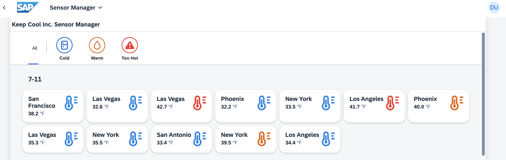
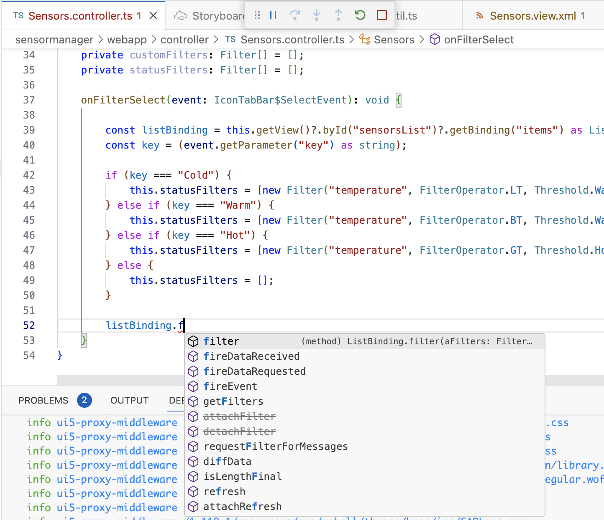
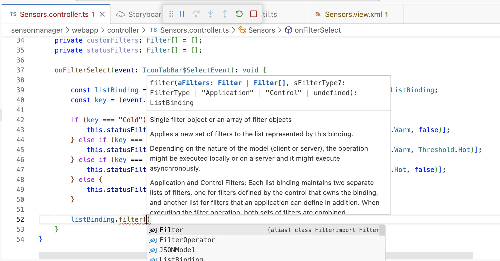
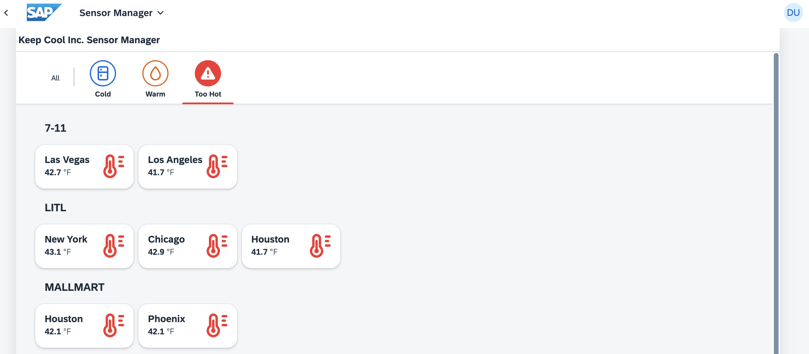

[](https://github.com/SAP-samples/teched2023-AD283v/tree/code/exercises/ex6)
[](https://pages.github.com/SAP-Samples/teched2023-AD283v/ex6/test/flpSandbox.html?sap-ui-xx-viewCache=false#keepcoolsensormanager-display)

# Exercise 6 - Filtering With the IconTabBar

As your customer needs the best overview to make decisions quickly, you will give them an option to narrow down the list of sensors based on the current sensor temperature.

## Exercise 6.1 - Add new IconTabFilters to the Sensors.view.xml

For this, you enhance your `sap.m.IconTabBar` control.

1. Open `sensormanager/webapp/view/Sensors.view.xml`.

2. Insert the `<items>` aggregation with `sap.m.IconTabFilter` elements to the beginning of the `sap.m.IconTabBar` control, before the `<content>` (actually the position does not matter, but `<items>` must be a sibling on the same level as `<content>`). The `IconTabFilter` elements will be visible as icons above the bar, so the user can click them to filter the list.

###### sensormanager/webapp/view/Sensors.view.xml

```xml
            <IconTabBar id="iconTabBar" class="sapUiResponsiveContentPadding">
                <items>
                    <IconTabFilter showAll="true" text="{i18n>msgFilterAll}" key="All"/>
                    <IconTabSeparator/>
                    <IconTabFilter icon="sap-icon://fridge" iconColor="Default" text="{i18n>msgFilterCold}" key="Cold"/>
                    <IconTabFilter icon="sap-icon://blur" iconColor="Critical" text="{i18n>msgFilterWarm}" key="Warm"/>
                    <IconTabFilter icon="sap-icon://warning" iconColor="Negative" text="{i18n>msgFilterHot}" key="Hot"/>
                </items>
                <content>
                ...
```

3. Let's see if your UI5 application now displays the newly introduced `sap.m.IconTabFilter` elements! Switch to the browser tab with the opened application preview (reload/relaunch if needed).



## Exercise 6.2 - Implement the Filtering

In the previous section you've added all necessary UI controls. Next, you'll implement the filtering logic.

1. Open `sensormanager/webapp/controller/Sensors.controller.ts`.

2. Implement the `onFilterSelect` function for filtering the sensor list items by checking their `status` property. You'll also make use of the previously defined threshold and use some filter settings to narrow down the result. `LT` for example means "less than". Enter the following into the class body, after the end of the `getSensorModel` method.

###### sensormanager/webapp/controller/Sensors.controller.ts

```js
    private statusFilters: Filter[] = [];

    onFilterSelect(event: IconTabBar$SelectEvent): void {

        const listBinding = this.getView()?.byId("sensorsList")?.getBinding("items") as ListBinding;
        const key = (event.getParameter("key") as string);

        if (key === "Cold") {
            this.statusFilters = [new Filter("temperature", FilterOperator.LT, Threshold.Warm, false)];
        } else if (key === "Warm") {
            this.statusFilters = [new Filter("temperature", FilterOperator.BT, Threshold.Warm, Threshold.Hot)];
        } else if (key === "Hot") {
            this.statusFilters = [new Filter("temperature", FilterOperator.GT, Threshold.Hot, false)];
        } else {
            this.statusFilters = [];
        }

        listBinding.filter(this.statusFilters);
    }
```

> #### 🧑‍🎓 Explanation
> You can again make use of the *Quick Fix...* functionality on hover to add the missing imports. Note that for `Filter` there are three modules available that will be recommended when triggering the > Quick Fix on `Filter`:
> - `sap/ui/model/Filter`
> - `sap/ui/model/odata/Filter`
> - `sap/ui/export/util/Filter`
>
>When triggering the Quick Fix on other missing modules and selecting "Add all missing imports", then one of them will be added. In any case, make sure the `sap/ui/model/Filter` module is imported, as this application is not using an OData model.

> #### 💡 Hint
> Try typing the last line of this code block manually: `listBinding.filter(this.statusFilters);` 
>
> Doing so, another advantage of TypeScript can be seen here, as there is type-ahead available, not only for variable names like `listBinding`, but also for available methods on the given variable type:
> 

>
> There is also direct access to the documentation while you are typing, e.g. for the method parameters:
>


## Exercise 6.3 - Assign the Filtering to the IconTabBar

Next, you need to assign the filtering function to the `select` event of the `sap.m.IconTabBar`.

1. Open `sensormanager/webapp/view/Sensors.view.xml`.

2. Bind the `onFilterSelect` function to the `select` event of the `IconTabBar`. Whenever one of the `sap.m.IconTabFilter` elements is clicked, this function will be called.

###### sensormanager/webapp/view/Sensors.view.xml

```xml
            <IconTabBar id="iconTabBar" select=".onFilterSelect" class="sapUiResponsiveContentPadding">
```

3. Let's see if your UI5 application is now able to filter the sensor data correctly. Switch to the browser tab with the opened application preview and reload the page. Click the *Too Hot* icon. Only sensors with too high a temperature are displayed.



## Summary

Well done! You've successfully enhanced your sensor manager application by adding an IconTabBar for filtering sensor data based on temperature. This new feature will enable quick and efficient decision-making for your users.

From the tutorial perspective, you have learned how displayed data can be filtered, how this filtering can be triggered by the user, and how TypeScript helps coding with code assist/autocomplete and showing the respective documentation in-place.

Keep up the good work and continue to [Exercise 7 - Fragment containing a Dialog](../ex7/README.md)!

## Further Information

* Model Filter in UI5: https://ui5.sap.com/#/topic/5295470d7eee46c1898ee46c1b9ad763
