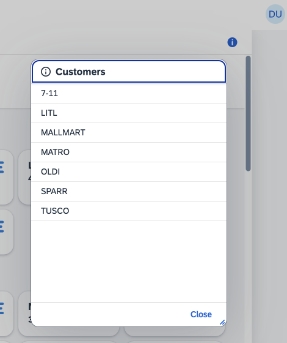
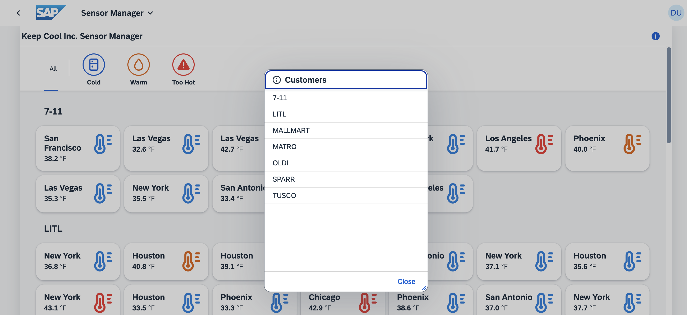

[](https://github.com/SAP-samples/teched2023-AD283v/tree/code/exercises/ex7)
[](https://pages.github.com/SAP-Samples/teched2023-AD283v/ex7/test/flpSandbox.html?sap-ui-xx-viewCache=false#keepcoolsensormanager-display)
# Exercise 7 - Utilizing Fragments and Dialogs

For a quick overview of all current customers, let's offer a dialog. To maintain separation of concerns, let's encapsulate this dialog's content within a Fragment. This enables potential reuse elsewhere.

## Exercise 7.1 - Generate a New Fragment Definition

A dialog presents an ideal scenario for utilizing a `sap.ui.core.Fragment`. This UI5 artifact aids in modularizing your code into smaller, reusable components.

1. Navigate to the folder `sensormanager/webapp/view/`.

2. Right-click on the `view` folder and choose `New File...`.


3. Specify `CustomerDialog.fragment.xml` as the file name.


4. Copy and paste the following content into the newly created `CustomerDialog.fragment.xml`. This will define a `sap.m.Dialog`, providing functionality to assist users in viewing their assigned icehouse clients.

###### sensormanager/webapp/view/CustomerDialog.fragment.xml

```xml
<core:FragmentDefinition
    xmlns="sap.m"
    xmlns:core="sap.ui.core">
    <Dialog
        title="{i18n>titleCustomerDialog}"
        icon="sap-icon://message-information"
        contentHeight="50%"
        resizable="true"
        draggable="true">
        <content>
            <List
                items="{
                    path: 'sensorModel>/customers',
                    sorter: {path:'name'}
                }">
                <StandardListItem title="{sensorModel>name}"/>
            </List>
        </content>
        <buttons>
            <Button text="Close" press=".onCustomerInfoClose"/>
        </buttons>
    </Dialog>
</core:FragmentDefinition>
```

## Exercise 7.2 - Implement Dialog Opening Logic

After defining the dialog, you need to implement the code that will trigger its opening.

1. Open `sensormanager/webapp/controller/Sensors.controller.ts`.

2. Within the class body, implement the `onCustomerInfoPress` function to open the dialog. You already know how to apply the *Quick Fix* to add any missing imports. Make sure that the Dialog is imported from `"sap/m/Dialog"` (there are more Dialogs in UI5)!

###### sensormanager/webapp/controller/Sensors.controller.ts

```js
    private dialog: Promise<Dialog>;

    onCustomerInfoPress(): void {
        this.dialog ??= this.loadFragment({
            name: "keepcool.sensormanager.view.CustomerDialog"
        }) as Promise<Dialog>;
    
        this.dialog.then((dialog) => dialog.open())
            .catch((err: Error) => MessageToast.show(err.message));
    }
```

> 🧑‍🎓 The example above demonstrates a form of lazy and conditional instantiation. The fragment content is loaded only when the dialog does not yet exist. The `??=` operator checks if the `dialog` variable has a truthy value. If so, the statement after the `??=` operator is not executed. If the `dialog` has a falsy value, the action after the `??=` is executed and the resulting value is assigned to the `dialog`.
>
> Because the fragment possibly needs to be loaded from the server (asynchronously), this resulting value is not directly the Dialog itself, but a [*Promise*](https://developer.mozilla.org/en-US/docs/Web/JavaScript/Reference/Global_Objects/Promise), a JavaScript construct that helps dealing with asynchronous code. This Promise *resolves* with the Dialog defined in the Fragment.
>
> The `loadFragment` method available on the controller instance assigns the fragment content as a "dependent" to the view, so all bound models available on the view are also available for the fragment content. Furthermore UI5 takes care to clean up the fragment content when the view is destroyed.

## Exercise 7.3 - Incorporate a Dialog Opening Button

After implementing the dialog opening logic, you need to link this logic to a control.

1. Open `sensormanager/webapp/view/Sensors.view.xml`.

2. Add a new button to the page header and bind its `press` event to the newly created `onCustomerInfoPress` function. You can do this by inserting the `<headerContent>` aggregation before (or after) the `<content>` of the `Page` control.

###### sensormanager/webapp/view/Sensors.view.xml

```xml
    <Page id="page" title="{i18n>title}">
        <headerContent>
            <Button icon="sap-icon://information" press=".onCustomerInfoPress" tooltip="{i18n>toolTipShowCustomers}"/>
        </headerContent>
        <content>
        ...
```

3. Switch to the application preview tab in your browser and refresh the page to observe the changes to your application's user interface. Click the "info" button in the upper right corner of the page to open the dialog. You cannot close the Dialog yet, though.



## Exercise 7.4 - Implement Dialog Closing Mechanism

1. Open `sensormanager/webapp/controller/Sensors.controller.ts`.

2. Within the class body, implement the `onCustomerInfoClose` function to close the dialog.

###### sensormanager/webapp/controller/Sensors.controller.ts

```js
    onCustomerInfoClose(): void {
        this.dialog.then(function(dialog){
            dialog.close();
        }).catch(function(err: Error){
            MessageToast.show(err.message);
        });
    }
```

> 🧑‍🎓 In the variable `this.dialog` not the Dialog itself is stored, but the Promise resolving with the Dialog. Hence calling `.then(...)` on it gives the Dialog. As this method is normally only triggered from within the Dialog, which can only be shown when the Dialog fragment is loaded successfully, the `catch(...)` clause is probably never executed (it would be triggered when the Promise loading the fragment fails) - but better be safe than sorry, these preconditions in the surrounding code might change.

3. Switch to the application preview tab in your browser to observe the changes to your application's user interface. Click the info button in the upper right corner to open the dialog, then test the closing functionality.



## Summary
You've done a fantastic job! In this exercise, you've successfully created a reusable fragment that encapsulates a dialog for displaying customer information in your application. You've also implemented the logic to open and close the dialog, and connected it to a button on the user interface. You're making great strides in modularizing your code and enhancing the user experience. 

Keep up the good work in [Exercise 8 - Second View with Navigation](../ex8/README.md)!

## Further Information
* Usage of Fragments in UI5: https://ui5.sap.com/#/topic/36a5b130076e4b4aac2c27eebf324909
* `sap.m.Dialog`: https://ui5.sap.com/#/api/sap.m.Dialog
