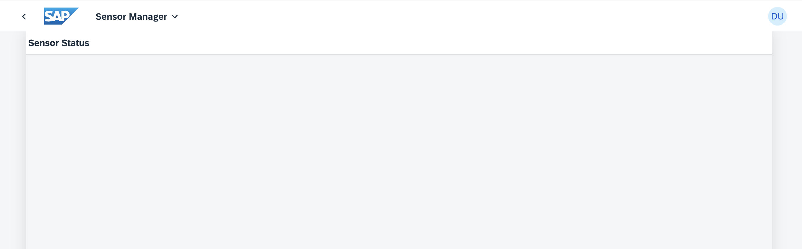

[](https://github.com/SAP-samples/teched2023-AD283v/tree/code/exercises/ex8)
[](https://pages.github.com/SAP-Samples/teched2023-AD283v/ex8/test/flpSandbox.html?sap-ui-xx-viewCache=false#keepcoolsensormanager-display)

# Exercise 8 - Add a Second View with Navigation

Your customer does not only want to have a broad overview of all their icehouses. In case of problems they'd like to inspect a specific sensor for recent temperature data. You'll add a second view to display history data.

## Exercise 8.1 - Create SensorStatus.view.xml

Create a new view as follows:

1. Go to folder `sensormanager/webapp/view/`.

2. Right-click on the `view` folder and select `New File`.

3. Enter `SensorStatus.view.xml` as file name.

4. Add an empty `sap.m.Page` to the newly created view.

###### sensormanager/webapp/view/SensorStatus.view.xml

```xml
<mvc:View
    displayBlock="true"
    xmlns:mvc="sap.ui.core.mvc"
    xmlns="sap.m">
    <Page
        id="SensorStatusPage"
        title="{i18n>titleSensorStatus}"
        navButtonPress=".navToSensors">
    </Page>
</mvc:View>
```

## Exercise 8.2 - Configure Routing in the `manifest.json` File

After creating the new view, you'll next add routing information for it to the `manifest.json` file. Routing takes care of displaying the desired UI5 view based on the given browser URL hash. This makes routing the standard means to navigate between different views/pages.

1. Open `sensormanager/webapp/manifest.json`.

2. Go to section `sap.ui5` / `routing` / `routes`.

3. Add a second route named "RouteSensorStatus" to the `routes` configuration. As result, `routes` should look like this:

###### sensormanager/webapp/manifest.json

```json
                "routes": [
                    {
                        "name": "RouteSensors",
                        "pattern": ":?query:",
                        "target": [
                            "TargetSensors"
                        ]
                    }, {
                        "name": "RouteSensorStatus",
                        "pattern": "sensor/{index}",
                        "target": ["TargetSensorStatus"]
                    }
                ],
```

>🧑‍🎓 A route is a way to address a specific part or state of an application with a specific URL hash pattern. The default route with empty pattern (or optional query as in this case) is what is displayed by default, the new route has the pattern `sensor/{index}`, so a URL hash starting with "sensor/" will trigger navigation to the target of this new route (target will be defined below). The path segment `{index}` in curly braces is variable and used to transport a value to the target, in this case *which* sensor should be displayed in detail.

4. Go one section down to `sap.ui5` / `routing` / `targets`.

5. Add a new entry to the `targets` configuration. This is the target of the newly added route and defines `SensorStatus` as the name of the view to display. It also defines the *viewLevel*, which helps routing to understand the navigation direction and displaying the correct transition animation. Add the corresponding *viewLevel* to the `TargetSensors`. In total, the `targets` section now needs to look like this:

###### sensormanager/webapp/manifest.json

```json
            "targets": {
                "TargetSensors": {
                    "viewType": "XML",
                    "transition": "slide",
                    "clearControlAggregation": false,
                    "viewId": "Sensors",
                    "viewName": "Sensors",
                    "viewLevel": 1
                },
                "TargetSensorStatus": {
                    "viewId": "sensorStatus",
                    "viewName": "SensorStatus",
                    "viewLevel": 2
                }
            }
```

> 🧑‍🎓 A target defines a view that is displayed, it can be referenced by one or more routes. Whenever a target is displayed, the corresponding view is loaded and shown in the app. The two targets point to the two content views which are now present in the application.
>
> The third view, `App.view.xml` is the root view. The routing mechanism controls the content of the `App` control inside it - which of the views should be displayed insid the `App`. This configuration happens in the `"config"` block a bit further up at the beginning of the `"routing"` section: this part contains the global router configuration and default values that apply for all routes and targets. It defines the router class that you want to use and where the views are located in the app.
> In paticular the following two lines define *which* UI control should be managed by the router (the `App` with the ID "app") and which of its aggregations should be used to automatically display the views ("pages"):
>
>                "controlAggregation": "pages",
>                "controlId": "app",

6. Let's see if the newly created view can be opened. Switch to the browser tab with the opened application preview. Add `&/sensor/7` at the end of the URL in the browser's address bar and the newly created page is displayed.

> 🧑‍🎓 The preview URL already contains a URL hash (`#keepcoolsensormanager-display`), so this routing hash part is appended with an ampersand (`&`).


## Exercise 8.3 - Implement the Navigation to the New View

Fine. You can access the newly created view. Next, you need to implement logic to navigate from your first view to the newly created one.

1. Open `sensormanager/webapp/controller/Sensors.controller.ts`.

2. Create the function `navToSensorStatus`. Here, you get the index of the currently selected sensor and navigate to the new view by passing the index. Again add all missing imports using the Quick Fix.

###### sensormanager/webapp/controller/Sensors.controller.ts

```js
    navToSensorStatus(event: ListItemBase$PressEvent) {
        const sensorIndex = event.getSource().getBindingContext("sensorModel")?.getProperty("index");
        (this.getOwnerComponent() as UIComponent).getRouter().navTo("RouteSensorStatus", {index: sensorIndex});
    }
```

> 🧑‍🎓 "RouteSensorStatus" is the route name you just added in `manifest.json`. This call triggers the route and UI5 displays the view belonging to the route's target. `index` was the variable part of the URL hash and is assigned a value - the number of the clicked sensor - here. When running the application, you will see the actual number at the end of the URL.


## Exercise 8.4 - Assign the Navigation Logic to the Sensor Items

After implementing the navigation logic you'll need to assign it to a control, so it can be triggered by the user.

1. Open `sensormanager/webapp/view/Sensors.view.xml`.

2. Add the `press` event to the `GridListItem` control and assign the newly created function.

###### sensormanager/webapp/view/Sensors.view.xml

```xml
                            <f:GridListItem type="Active" press=".navToSensorStatus">
```

3. Let's see if the navigation logic works. Switch to the browser tab with the opened application preview. Remove the "&/sensor/7" part you just added for testing and press *Enter* to get to the main overview page again. Or simply re-launch the preview page from BAS. Then click any sensor. The navigation takes place, and you see the newly created empty view.



## Exercise 8.5 - Create SensorStatus.controller.ts and Implement the Back-Navigation
Nice. Now let's implement the navigation back to `Sensors.view.xml`. To do this, you'll need a new controller for the newly created view.

1. In folder `sensormanager/webapp/controller/`, right-click on the `controller` folder and select `New File`.

2. Enter `SensorStatus.controller.ts` as file name.

3. Copy and paste the controller definition given below into the newly created `SensorStatus.controller.ts`. The `navToSensors` method uses the router's `navTo` method for triggering the `RouteSensors` route, pointing to the initial `Sensors.view.xml` view.

###### sensormanager/webapp/controller/SensorStatus.controller.ts

```js
import Controller from "sap/ui/core/mvc/Controller";
import UIComponent from "sap/ui/core/UIComponent";

/**
 * @namespace keepcool.sensormanager.controller
 */
export default class SensorStatus extends Controller {

    public onInit() {

    }

    navToSensors() {
        (this.getOwnerComponent() as UIComponent).getRouter().navTo("RouteSensors");
    }

}

```


## Exercise 8.6 - Trigger the Back-Navigation from the SensorStatus View

1. Open `sensormanager/webapp/view/SensorStatus.view.xml`.

2. Add the `controllerName` attribute in `sensormanager/webapp/view/Sensors.view.xml` to assign the new controller to the view. Also, add the `navButtonPress` attribute to the `sap.m.Page` control and assign the newly created `navToSensors` function as handler to this event.

###### sensormanager/webapp/view/SensorStatus.view.xml

```xml
<mvc:View
    controllerName="keepcool.sensormanager.controller.SensorStatus"
    displayBlock="true"
    xmlns:mvc="sap.ui.core.mvc"
    xmlns="sap.m">
    <Page
        id="SensorStatusPage"
        title="{i18n>titleSensorStatus}"
        showNavButton="true"
        navButtonPress=".navToSensors">
    </Page>
</mvc:View>
```

3. Let's see if the navigation logic works. Switch to the browser tab with the opened application preview. In the URL, remove any previously added URL hash and reload the page.


4. Click any sensor. The navigation takes place, and you see the newly created view.


5. Click the "<" button to navigate back to the sensor list. Thanks to how the Router works, you can also use the "Back" button of the browser or your mobile device instead.


## Summary

Great job on completing Exercise 8! You've successfully added a second view to your application and implemented navigation between views using the routing functionality of SAPUI5. You've made significant progress in enhancing your application's utility and user experience. Keep up the good work and carry on to [Exercise 9 - Card with NumericHeader](../ex9/README.md).

## Further Information

* Routing in UI5: https://ui5.sap.com/#/topic/902313063d6f45aeaa3388cc4c13c34e
