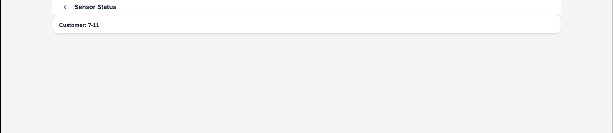
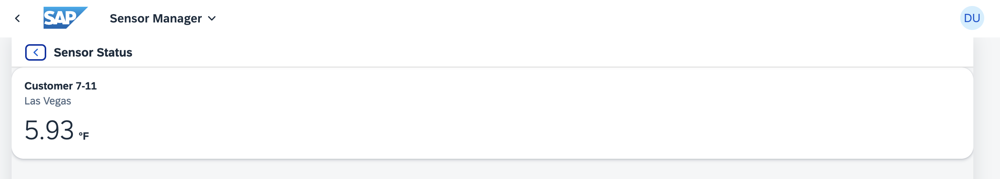
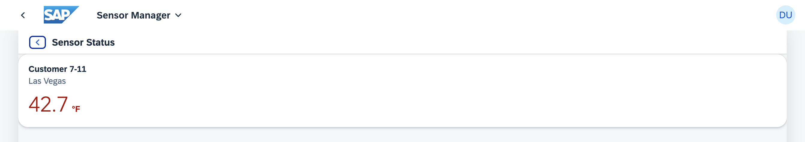
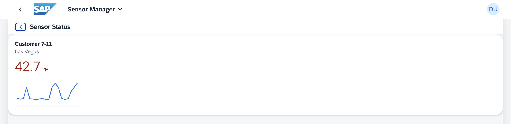
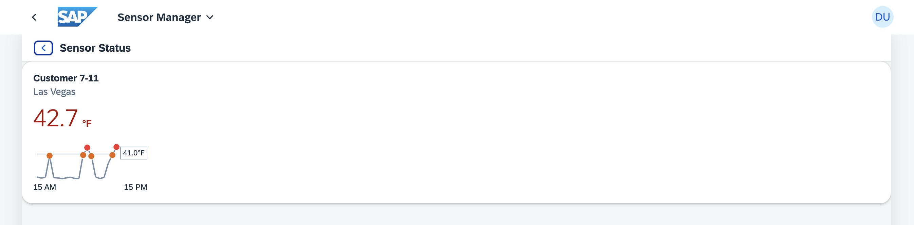

[](https://github.com/SAP-samples/teched2023-AD283v/tree/code/exercises/ex9)
[](https://pages.github.com/SAP-Samples/teched2023-AD283v/ex9/test/flpSandbox.html?sap-ui-xx-viewCache=false#keepcoolsensormanager-display)

# Exercise 9 - Enhancing Sensor Details with a Card

In this exercise, you'll be augmenting the sensor status page with an `sap.f.Card` to present additional data about the sensor's status. You'll also implement some layouting with box controls and incorporate an `sap.f.cards.NumericHeader` to accurately represent the temperature.

## Exercise 9.1 - Embedding a Card in SensorStatus.view.xml

Let's start with spiffing up the `SensorStatus.view.xml` view.

1. Open `sensormanager/webapp/view/SensorStatus.view.xml`.

2. Add the `sap.f` and `sap.f.cards` libraries to `SensorStatus.view.xml`.

###### sensormanager/webapp/view/SensorStatus.view.xml

```xml
<mvc:View
    controllerName="keepcool.sensormanager.controller.SensorStatus"
    displayBlock="true"
    xmlns:mvc="sap.ui.core.mvc"
    xmlns="sap.m"
    xmlns:f="sap.f"
    xmlns:card="sap.f.cards">
```

3. Embed an `sap.f.Card` with a card header into `SensorStatus.view.xml`. Add the customer name as the header title through data binding. To do this, replace the `<Page>...</Page>` with the following:

###### sensormanager/webapp/view/SensorStatus.view.xml

```xml
    <Page
        id="SensorStatusPage"
        title="{i18n>titleSensorStatus}"
        showNavButton="true"
        navButtonPress=".navToSensors">
        <content>
            <f:Card width="200px" class="sapUiSmallMargin">
                <f:header>
                    <card:Header title="{parts: ['i18n>cardTitle', 'sensorModel>customer']}"/>
                </f:header>
                <f:content>

                </f:content>
            </f:Card>
        </content>
    </Page>
```

## Exercise 9.2 - Set the Data Context in SensorStatus.controller.ts

To display the data for the chosen sensor in your card, you need to access the data provided by the Router for the navigation step and assign the correct binding context to the view. This way, the standard data binding will work with the data related to the chosen sensor.

1. Open `sensormanager/webapp/controller/SensorStatus.controller.ts`.

2. Attach a callback function to the `routeMatched` event to fetch the passed sensor index and utilize it in the data binding path for the view. You also have to define a TypeScript interface for the parameter object, so that the type of index is clearly defined as `number`. As result, the file should look like this:

###### sensormanager/webapp/controller/SensorStatus.controller.ts

```js
import Controller from "sap/ui/core/mvc/Controller";
import UIComponent from "sap/ui/core/UIComponent";
import { Route$MatchedEvent } from "sap/ui/core/routing/Route";

interface RouteMatchedParameters {
    index: number
}

/**
 * @namespace keepcool.sensormanager.controller
 */
export default class SensorStatus extends Controller {
    public onInit() {
        (this.getOwnerComponent() as UIComponent).getRouter().getRoute("RouteSensorStatus")?.attachMatched(this.onRouteMatched, this);
    }

    public onRouteMatched(event: Route$MatchedEvent) {
        this.getView()?.bindElement({
            path: "/sensors/" + (event.getParameter("arguments") as RouteMatchedParameters).index,
            model: "sensorModel"
        });
    }

    public navToSensors() {
        (this.getOwnerComponent() as UIComponent).getRouter().navTo("RouteSensors");
    }

}
```

> #### 🧑‍🎓 Explanation
> Within `onRouteMatched`, the first line sets the data binding context to the values filled below: the *model* is the WsensorModel" one holding the sensor data and the *path* inside the model from which the data is used is "/sensors/" plus the index of the clicked sensor, which is retrieved from the routing event. The resulting path (like e.g. `/sensors/8`) refers to the data of one specific sensor in the JSON data structure.
>
> When data properties like "temperature" are used in this view's data binding, they automatically refer to the temperature of the sensor with the current index 8.

3. Switch to the browser tab where the application preview is opened. Click any sensor. Now the sensor status page contains a card with the customer name.



## Exercise 9.3 - Add a NumericHeader to the Card

To further enhance the visualization, you will swap the `sap.f.cards.Header` with the `sap.f.cards.NumericHeader` in your newly created card.

1. Open `sensormanager/webapp/view/SensorStatus.view.xml` and exchange the existing `<f:header>` content with the following:

###### sensormanager/webapp/view/SensorStatus.view.xml

```xml
                <f:header>
                    <card:NumericHeader title="{i18n>cardTitle} {sensorModel>customer}"
                        subtitle="{sensorModel>location}" number="{sensorModel>temperature}" scale="{i18n>temperatureUnit}"/>
                </f:header>
```

2. Switch to the browser tab where the application preview is open. Click on any sensor. Now, the sensor status page presents a card that includes temperature information (still without Fahrenheit conversion).



3. Add a formatter to apply semantic coloring to the card header.
The formatter utilizes both the threshold and the current temperature from the model. Based on these values, it returns the `sap.m.ValueColor`. Open `sensormanager/webapp/format/util.ts` and insert the formatter function given below. Don't forget to import the `sap.m.ValueColor` module, which offers excellent color support, using the *Quick Fix*.

###### sensormanager/webapp/format/util.ts

```js
export function formatValueColor(temperature: number): ValueColor {
    if (temperature < Threshold.Warm) {
        return ValueColor.Neutral;
    } else if (temperature >= Threshold.Warm && temperature < Threshold.Hot) {
        return ValueColor.Critical;
    } else {
        return ValueColor.Error;
    }
}
```

4. The `sap.f.cards.NumericHeader` control features a `state` property, which enables you to present the state of your control in a visually engaging manner. Proceed to open `sensormanager/webapp/view/SensorStatus.view.xml`.

5. First add the dependency to retrieve the required `util`, including the "core" namespace needed for the "require" itself.

###### sensormanager/webapp/view/SensorStatus.view.xml

```xml
<mvc:View displayBlock="true"
    controllerName="keepcool.sensormanager.controller.SensorStatus"
    xmlns:mvc="sap.ui.core.mvc"
    xmlns="sap.m"
    xmlns:f="sap.f"
    xmlns:card="sap.f.cards"
    xmlns:core="sap.ui.core"
    core:require="{
        util: 'keepcool/sensormanager/format/util'
    }">
```

6. Add the `state` property to your numeric header and enter data binding information pointing to your newly created formatter function. As you have access to the `util` module, you also use it for the number formatting and Fahrenheit conversion.

###### sensormanager/webapp/view/SensorStatus.view.xml

```xml
                <f:header>
                    <card:NumericHeader title="{i18n>cardTitle} {sensorModel>customer}" subtitle="{sensorModel>location}"
                        number="{parts: ['sensorModel>temperature', 'i18n>temperatureUnit'], formatter:'util.formatTemperature'}"
                        scale="{i18n>temperatureUnit}" state="{path: 'sensorModel>temperature', formatter: 'util.formatValueColor'}" />
                </f:header>
```

7. Switch to the browser tab where the application preview is opened. Select any sensor. The sensor status page should now display a card with color-coded temperature details that vary based on the temperature value.



## Exercise 9.4 - Add a Chart to the Card

To show some historical data you can use the `temperatureLog` of the sensor data. You'll use an `sap.suite.ui.microchart.LineMicroChart`to add the data points.

1. Open `sensormanager/webapp/view/SensorStatus.view.xml`.

2. Add the namespace for the `sap.suite.ui.microchart` library to the `SensorStatus.view.xml`.

###### SensorStatus/webapp/view/SensorStatus.view.xml

```xml
<mvc:View
    controllerName="keepcool.sensormanager.controller.SensorStatus"
    displayBlock="true"
    xmlns:mvc="sap.ui.core.mvc"
    xmlns="sap.m"
    xmlns:f="sap.f"
    xmlns:card="sap.f.cards"
    xmlns:core="sap.ui.core"
    core:require="{
        util: 'keepcool/sensormanager/format/util'
    }"
    xmlns:mc="sap.suite.ui.microchart">
```

3. Add the chart to the content aggregation of the card and bind the `temperatureLog` to the `points` aggregation. For each point you'll display the `temperature` property.

###### SensorStatus/webapp/view/SensorStatus.view.xml

```xml
                <f:content>
                    <mc:LineMicroChart
                        id="lineMicroChart"
                        class="sapUiSmallMarginBeginEnd sapUiSmallMarginBottom"
                        size="Auto"
                        points="{sensorModel>temperatureLog}">
                        <mc:LineMicroChartEmphasizedPoint
                            x="{sensorModel>time}"
                            y="{sensorModel>temperature}"/>
                    </mc:LineMicroChart>
                </f:content>
```

> 🧑‍🎓 In the JSON data, the `temperatureLog` in each sensor is an extensive array containing historical temperature data and the corresponding timestamp. By binding the `points` to this array, each `temperatureLog` entry will serve as one point in the chart. X and Y values are mapped in the `LineMicroChartEmphasizedPoint` settings.

4. Switch to the browser tab where the application preview is opened. Click any sensor. Now the sensor status page contains a chart with a temperature history.



## Exercise 9.5 - Add Additional Information

1. Open `sensormanager/webapp/view/SensorStatus.view.xml`.

2. To enhance the readability of the chart, you should provide some additional information. Add labels to the chart along with an indicator for the threshold. As done in previous exercises, also provide some semantic coloring and show only the relevant data points with the help of expression binding.

###### SensorStatus/webapp/view/SensorStatus.view.xml

```xml
                <f:content>
                    <mc:LineMicroChart
                        id="lineMicroChart"
                        class="sapUiSmallMarginBeginEnd sapUiSmallMarginBottom"
                        leftBottomLabel="15 AM"
                        rightBottomLabel="15 PM"
                        threshold="{=util.formatTemperature(util.Threshold.Hot, ${i18n>temperatureUnit})}"
                        thresholdDisplayValue="{=util.formatTemperature(util.Threshold.Hot) + '{i18n>temperatureUnit}'}"
                        showThresholdValue="true"
                        size="Auto"
                        points="{sensorModel>temperatureLog}">
                        <mc:LineMicroChartEmphasizedPoint
                            x="{sensorModel>time}"
                            y="{parts: ['sensorModel>temperature', 'i18n>temperatureUnit'], formatter:'util.formatTemperature'}"
                            color="{path: 'sensorModel>temperature', formatter:'util.formatValueColor'}"
                            show="{=${sensorModel>temperature}>util.Threshold.Warm}"/>
                    </mc:LineMicroChart>
                </f:content>
```
3. Switch to the browser tab where the application preview is displayed. Select any sensor. The sensor status page should now exhibit a chart containing a temperature history with colored data points, additional labels and a threshold line.



## Summary

Congratulations! You've successfully enriched your sensor status page with a detailed card showing sensor information. This card, created using `sap.f.Card` and `sap.f.cards.NumericHeader`, displays valuable sensor data such as temperature, customer details, and a history chart of temperature data. You've also learned how to use microcharts with additional features like emphasized points, threshold lines and semantic coloring for better data visualization. These enhancements bring you one step closer to mastering UI5 applications.

Keep going as there is only one step left to make your application available to the users with [Exercise 10 - Deployment to SAP BTP - Cloud Foundry runtime](../ex10/README.md).

## Further Information
* Cards: https://ui5.sap.com/#/topic/5b46b03f024542ba802d99d67bc1a3f4
* `sap.f.Card`: https://ui5.sap.com/#/api/sap.f.Card
* `sap.f.cards.NumericHeader`: https://ui5.sap.com/#/api/sap.f.cards.NumericHeader
* Methods and Events for Navigation
: https://ui5.sap.com/#/topic/516e477e7e0b4e188b19a406e7528c1e
* UI5 Microcharts: https://ui5.sap.com/#/topic/9cbe3f06465e47b8a136956034a718ed
* Formatting, Parsing, and Validating Data: https://ui5.sap.com/#/topic/07e4b920f5734fd78fdaa236f26236d8
